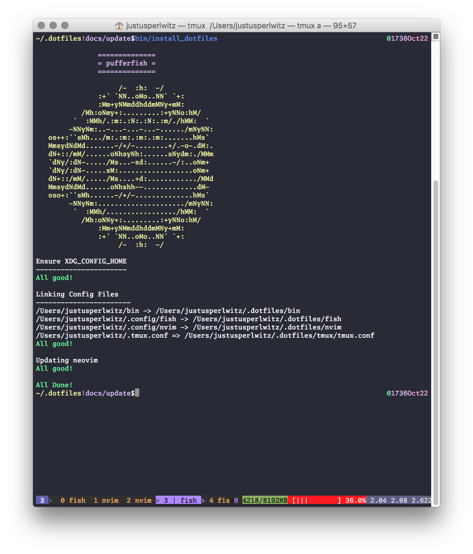

# pufferfish


Add useful defaults and configuration files for

-   tmux,
-   neovim, and
-   fish

Please also refer to the
[Wiki](https://github.com/justuswilhelm/pufferfish/wiki)
for more documentation on the individual features implemented in pufferfish.

## Installing fish

After installing fish, ensure that fish is your login shell, meaning that if
you open a new terminal session fish will be launched. Find out how to do this
[here](https://fishshell.com/docs/current/faq.html#faq-default)



## Quickstart on macOS

```bash
brew update
brew install neovim fish git
git clone git@github.com:justuswilhelm/pufferfish.git "$HOME/.dotfiles"
cd "$HOME/.dotfiles"
bin/install_dotfiles
```

## Quickstart on Debian and Ubuntu

```bash
apt update
apt install -y install neovim fish git
git clone git@github.com:justuswilhelm/pufferfish.git "$HOME/.dotfiles"
cd "$HOME/.dotfiles"
bin/install_dotfiles
```

## How to report a bug

You can file an issue
[here](https://github.com/justuswilhelm/pufferfish/issues/new)

## How to contribute code

I am happy about accepting new contributions into this repository. You can file
a pull request right
[here](https://github.com/justuswilhelm/pufferfish/compare).

The best way to get started is by forking this repository and developing a new
feature or bug fix on your own repository. Then, you can create a pull request
to contribute the code back.

## How to remap Caps Lock to Return

When using X11, try this:

```
sudo patch --strip=6 --directory=/usr/share/X11/xkb/symbols/ < x/patch-fix_pc-0001.patch
```

Undo this change by running

```
sudo patch --reverse --strip=6 --directory=/usr/share/X11/xkb/symbols/ < x/patch-fix_pc-0001.patch
```

Previously, the way the key mapping was changed, was using a Xmodmap configuration
like so:

```
clear lock
keycode 66 = Return
```

And configured with

```
xmodmap ~/.Xmodmap
```

# License

Everything I have created myself is licensed under the MIT License. Other works
included in this project are licensed under their respective licenses.

-   Iosevka (`fonts/`): SIL Open Font License v1.1, refer to `fonts/LICENSE.md`
