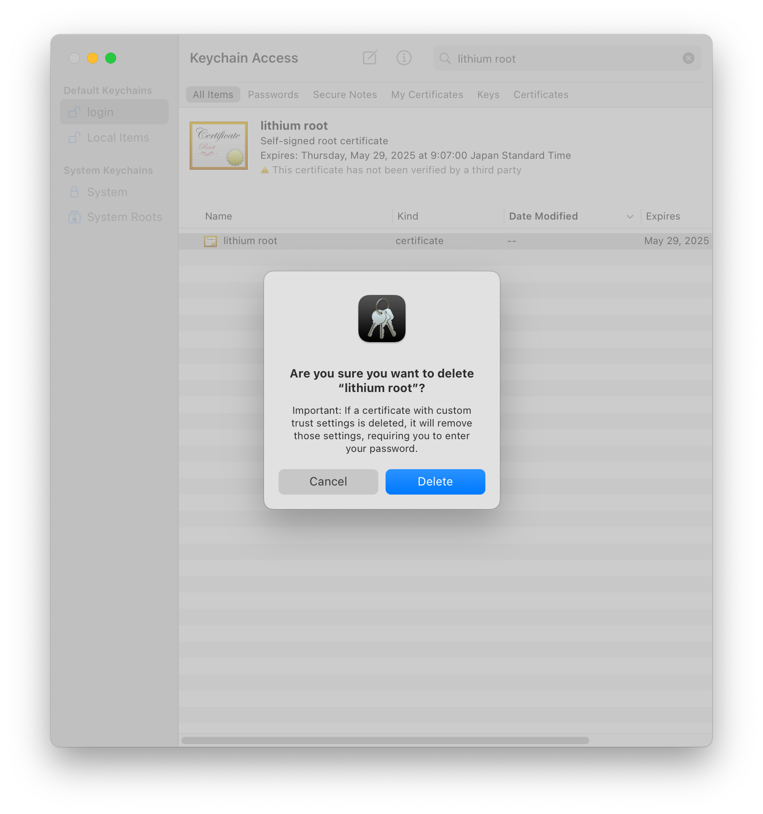
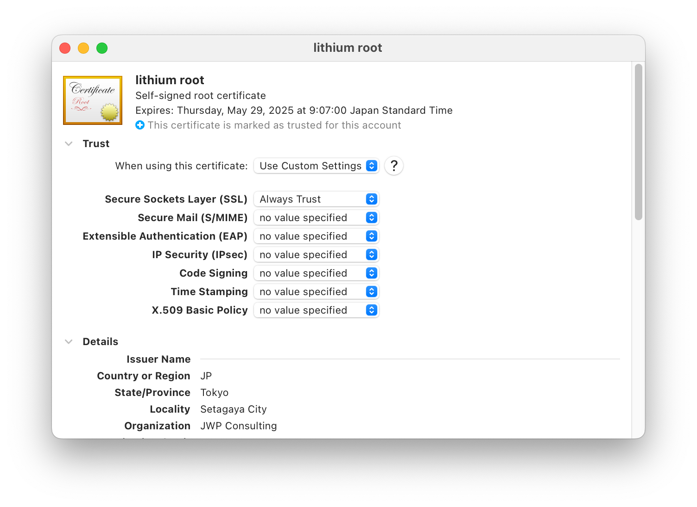

<!--
SPDX-FileCopyrightText: 2014-2025 Justus Perlwitz

SPDX-License-Identifier: GPL-3.0-or-later
-->

---
title: Certificate management with OpenSSL and Caddy
author: Justus Perlwitz
---

Tested with LibreSSL 3.3.6

Create the certificates needed to serve the Caddy revproxy from
https://lithium.local

# Users

This step applies under the following circumstances:

- You are creating your first root CA certificate
- You are creating your first Caddy certificate

Ensure that you have the following two users:

- `lithium-ca`: Manages the root CA certificate
- `caddy`: Servers the reverse proxy

# Create the root CA directories

This step applies under the following circumstances:

- You are creating your first root CA certificate

First, create the following three directories:

- `/var/lib/lithium-ca`: Directory where `lithium-ca`
- `/var/lib/lithium-ca/secrets`: Contain signing data that only `lithium-ca` is allowed to
access
- `/var/lib/lithium-ca/signed`: Contain signed certificates, open to public

Run the following commands:

```bash
sudo mkdir -p /var/lib/lithium-ca
sudo chown lithium-ca:lithium-ca /var/lib/lithium-ca
sudo -u lithium-ca mkdir -m 700 /var/lib/lithium-ca/secrets
sudo -u lithium-ca mkdir /var/lib/lithium-ca/signed
```

# Create the root CA secret

This step applies under the following circumstances:

- You are creating your first root CA certificate
- You are creating a new root CA certificate after the previous certificate expired.

Create the root key `lithium-ca.key` using the following command and ensure that only
`lithium-ca` can read it using the following commands:

```bash
sudo -u lithium-ca openssl ecparam \
  -name prime256v1 \
  -genkey \
  -noout \
  -out /var/lib/lithium-ca/secrets/lithium-ca.key
sudo -u lithium-ca chmod 600 /var/lib/lithium-ca/secrets/lithium-ca.key
```

# Create the root CA certificate

This step applies under the following circumstances:

- You are creating your first root CA certificate
- You are creating a new root CA certificate after the previous certificate expired.

Create the root certificate `lithium-ca.crt` using the following commands:

```bash
sudo -u lithium-ca openssl req -new \
  -subj "/C=JP/ST=Tokyo/L=Setagaya City/O=JWP Consulting/OU=Com/CN=lithium root" \
  -x509 \
  -sha256 \
  -days 90 \
  -nodes \
  -key /var/lib/lithium-ca/secrets/lithium-ca.key \
  -out /var/lib/lithium-ca/lithium-ca.crt
sudo -u lithium-ca chmod 644 /var/lib/lithium-ca/lithium-ca.crt
```

# Create the Caddy certificate directories

This step applies under the following circumstances:

- You are creating your first Caddy certificate.

Next, create the following three directories:

- `/var/lib/caddy`: Contains `caddy` user data
- `/var/lib/caddy/certs`: Contains `caddy` user certificates. This
directory is world readable
- `/var/lib/caddy/secrets`: Contains `caddy` user secrets. The keys in this
directory are used to sign `caddy`'s certificates. The directory is not world-readable.

```bash
sudo mkdir -p /var/lib/caddy
sudo chown caddy:caddy /var/lib/caddy

sudo mkdir -p /var/lib/caddy/certs
sudo chmod 755 /var/lib/caddy/certs

sudo -u caddy mkdir -m 700 /var/lib/caddy/secrets
```

# Create the Caddy private key

This step applies under the following circumstances:

- You are creating your first Caddy certificate.
- You are recreating a new Caddy certificate after the previous certificate expired.

Create the private key `lithium-server.key` used for the Caddy certificate and
store it in `/var/lib/caddy/secrets`. The key has read and write permissions
only for `caddy`. Run the following commands:

```bash
sudo -u caddy openssl ecparam \
  -name prime256v1 \
  -genkey \
  -noout \
  -out /var/lib/caddy/secrets/lithium-server.key
sudo -u caddy chmod 600 /var/lib/caddy/secrets/lithium-server.key
```

# Create the Caddy certificate signing request

This step applies under the following circumstances:

- You are creating your first Caddy certificate.
- You are recreating a new Caddy certificate after the previous certificate expired.

Create the caddy server signing request and place it in `/var/lib/caddy/certs`.
Make it world readable so that `lithium-ca` can process it. Run the following:

```bash
sudo -u caddy openssl req -new \
  -subj "/C=JP/ST=Tokyo/L=Setagaya City/O=JWP Consulting/OU=Com/CN=lithium.local" \
  -sha256 \
  -days 30 \
  -nodes \
  -key /var/lib/caddy/secrets/lithium-server.key \
  -out /var/lib/caddy/certs/lithium-server.csr
sudo -u caddy chmod 644 /var/lib/caddy/certs/lithium-server.csr
```

# Create the Caddy certificate extension file

This step applies under the following circumstances:

- You are creating your first Caddy certificate.

`lithium-ca` now creates a certificate extension file used when signing
`caddy`'s certificate. Use the following commands:

```bash
echo "subjectKeyIdentifier = hash
authorityKeyIdentifier = keyid,issuer
basicConstraints = CA:FALSE
keyUsage = digitalSignature
extendedKeyUsage = serverAuth,clientAuth
subjectAltName = DNS:lithium.local
issuerAltName = issuer:copy" | \
sudo -u lithium-ca tee /var/lib/lithium-ca/signed/lithium-server.ext
sudo -u lithium-ca chmod 644 /var/lib/lithium-ca/signed/lithium-server.ext
```

# Sign the Caddy certificate signing request

This step applies under the following circumstances:

- You are creating your first Caddy certificate.
- You are recreating a new Caddy certificate after the previous certificate expired.

`lithium-ca` now signs the certificate signing request created by `caddy`.
The resulting certificate `lithium-server.crt` is stored in
`/var/lib/lithium-ca/signed`. `caddy` then copies this certificate into
`/var/lib/caddy/certs` and makes it world-readonly.

```bash
sudo -u lithium-ca openssl x509 \
  -req \
  -sha256 \
  -in /var/lib/caddy/certs/lithium-server.csr \
  -CA /var/lib/lithium-ca/lithium-ca.crt \
  -CAkey /var/lib/lithium-ca/secrets/lithium-ca.key \
  -CAcreateserial \
  -extfile /var/lib/lithium-ca/signed/lithium-server.ext \
  -out /var/lib/lithium-ca/signed/lithium-server.crt
sudo -u caddy cp /var/lib/lithium-ca/signed/lithium-server.crt /var/lib/caddy/certs/
sudo chmod 644 /var/lib/caddy/certs/lithium-server.crt
```

# Import the root CA certificate

This step applies under the following circumstances:

- You are creating your first root CA certificate
- You are creating a new root CA certificate after the previous certificate expired.

## macOS

Open `Keychain Access`. Delete certificate called `lithium root` if
exists. The certificate is in the `login` keychain under **Default Keychains**.



Then, open the certificate using the following command run in your terminal:

```bash
open /var/lib/lithium-ca/lithium-ca.crt
```

Open certificate in *Default Keychains* > *login*. Under *Trust*, choose "Always Trust" for **Secure Sockets Layer (SSL)**. Close and confirm by entering administration password.



## Nix and NixOS

Update `nix/lithium-ca.crt` and make a Git commit.

```bash
install /var/lib/lithium-ca/lithium-ca.crt $HOME/.dotfiles/nix/lithium-ca.crt
git add $HOME/.dotfiles/nix/lithium-ca.crt
git commit --message "Nix: Update lithium-ca.crt"
```

Then, commit and rebuild NixOS and nix home configuration.

# Restart caddy

This step applies under the following circumstances:

- You are creating your first Caddy certificate.
- You are recreating a new Caddy certificate after the previous certificate expired.

```bash
sudo launchctl kill 15 system/net.jwpconsulting.caddy -k -p
```

# Sources

- https://blog.devolutions.net/2020/07/tutorial-how-to-generate-secure-self-signed-server-and-client-certificates-with-openssl/
- https://gist.github.com/KeithYeh/bb07cadd23645a6a62509b1ec8986bbc
- https://dev.to/techschoolguru/how-to-create-sign-ssl-tls-certificates-2aai
