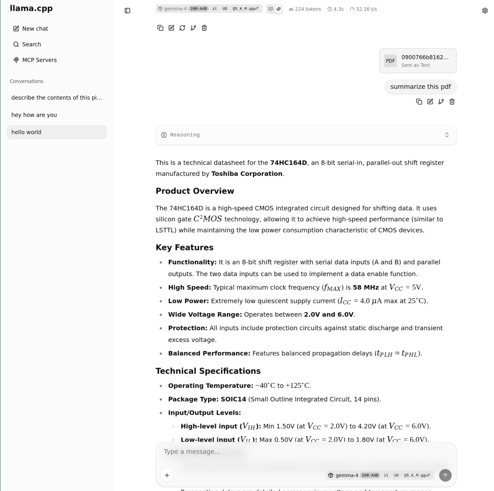
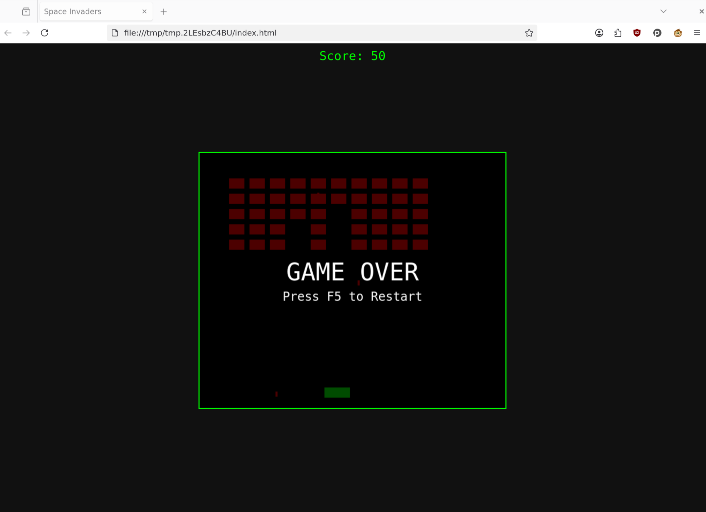
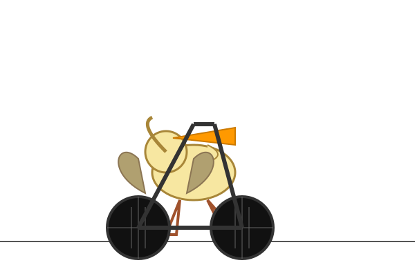

<!--
SPDX-FileCopyrightText: 2014-2025 Justus Perlwitz

SPDX-License-Identifier: GPL-3.0-or-later
-->


This document contains commands and expected outputs that you'll encounter
while setting up the helium-cuda VM.

# Find PCI device information

See: <https://www.theseus-os.com/Theseus/book/running/virtual_machine/pci_passthrough.html>

I already know that my GPU has the PCI path `01:00`.

```bash
sudo lspci -vnn -s 01:00
```

```
01:00.0 VGA compatible controller [0300]: NVIDIA Corporation GA102 [GeForce RTX 3090 Ti] [10de:2203] (rev a1) (prog-if 00 [VGA controller])
	Subsystem: Micro-Star International Co., Ltd. [MSI] Device [1462:5091]
	Flags: fast devsel, IRQ 16, IOMMU group 19
	Memory at 81000000 (32-bit, non-prefetchable) [size=16M]
	Memory at 6000000000 (64-bit, prefetchable) [size=32G]
	Memory at 6800000000 (64-bit, prefetchable) [size=32M]
	I/O ports at 5000 [size=128]
	Expansion ROM at 82000000 [disabled] [size=512K]
	Capabilities: <access denied>
	Kernel driver in use: vfio-pci
	Kernel modules: nvidiafb, nouveau

01:00.1 Audio device [0403]: NVIDIA Corporation GA102 High Definition Audio Controller [10de:1aef] (rev a1)
	Subsystem: Micro-Star International Co., Ltd. [MSI] Device [1462:5091]
	Flags: bus master, fast devsel, latency 0, IRQ 17, IOMMU group 19
	Memory at 82080000 (32-bit, non-prefetchable) [size=16K]
	Capabilities: <access denied>
	Kernel driver in use: snd_hda_intel
	Kernel modules: snd_hda_intel
```

Note the following values from the `lspci` output:

1. VGA compatible controller
  1. `slot_info`: 0000:01:00.0
  2. `vendor_id`: 10de
  3. `device_code`: 2203
2. Audio device
  1. `slot_info`: 0000:01:00.1
  2. `vendor_id`: 10de
  3. `device_code`: 1aef

I've found that forwarding both devices works better for PCI forwarding.

# Libvirt PCI name

Here's how to find the name for the two devices in libvirt. You need
these names to set up PCI forwarding. The `slot_info` 0000:01:00.0
becomes `pci_0000_01`.

Run this command:

```
virsh nodedev-list | grep pci_0000_01
```

You should see the following:

```
pci_0000_01_00_0
pci_0000_01_00_1
```

# Virt-install invocation

These instructions use virt-install to automate loading a NixOS image
into a virtual machine.

Here's what the virt-install `--help` help says about PCI forwarding:

> Device Options
>
> --host-device=HOSTDEV
> Attach a physical host device to the guest. Some example values for HOSTDEV:
> --host-device pci_0000_00_1b_0
>     A node device name via libvirt, as shown by 'virsh nodedev-list'
> --host-device 001.003
>     USB by bus, device (via lsusb).
> --host-device 0x1234:0x5678
>     USB by vendor, product (via lsusb).
> --host-device 1f.01.02
>     PCI device (via lspci).
> --soundhw MODEL
> Attach a virtual audio device to the guest. MODEL specifies the emulated sound card model. Possible values are ich6, ac97, es1370, sb16, pcspk, or default. 'default' will be AC97 if the hypervisor supports it, otherwise it will be ES1370 .

Source: <https://linux.die.net/man/1/virt-install>

For PCI forwarding, you need the `--host-device` flag.

# Build qcow2 image

Build a qcow2 image to load into virt-install:

```bash
cp --no-preserve=all $(nix build .#nixosConfigurations.helium-cuda.config.system.build.qcow --print-out-paths --no-link)/helium-cuda.qcow2 .
```

```bash
file nixos.qcow2
```

You should see the following:

```
nixos.qcow2: QEMU QCOW Image (v3), 27473739776 bytes (v3), 27473739776 bytes
```

Build the image and create a new virtual machine with `virt-install`:

```
cp --no-preserve=all $(nix build .#nixosConfigurations.helium-cuda.config.system.build.qcow --print-out-paths --no-link)/helium-cuda.qcow2 .
virt-install --connect qemu:///system \
  --import \
  --name helium-cuda \
  --memory 60000 \
  --vcpus 16 \
  --disk helium-cuda.qcow2 \
  --os-variant nixos-unstable \
  --network default \
  --host-device pci_0000_01_00_0 \
  --host-device pci_0000_01_00_1 \
  --boot uefi
```

Once VM starts up, test

```bash
ssh helium-cuda.local uname -a
```

Should output:

```
Linux helium-cuda 6.12.87 #1-NixOS SMP PREEMPT_DYNAMIC Fri May  8 06:39:25 UTC 2026 x86_64 GNU/Linux
```

Print NVIDIA driver information:

```bash
ssh helium-cuda.local nvidia-smi
```

Should output:

```
Mon May 18 07:08:44 2026
+-----------------------------------------------------------------------------------------+
| NVIDIA-SMI 570.172.08             Driver Version: 570.172.08     CUDA Version: 12.8     |
|-----------------------------------------+------------------------+----------------------+
| GPU  Name                 Persistence-M | Bus-Id          Disp.A | Volatile Uncorr. ECC |
| Fan  Temp   Perf          Pwr:Usage/Cap |           Memory-Usage | GPU-Util  Compute M. |
|                                         |                        |               MIG M. |
|=========================================+========================+======================|
|   0  NVIDIA GeForce RTX 3090 Ti     Off |   00000000:05:00.0 Off |                  Off |
| 32%   46C    P0            N/A  /  450W |       0MiB /  24564MiB |      0%      Default |
|                                         |                        |                  N/A |
+-----------------------------------------+------------------------+----------------------+

+-----------------------------------------------------------------------------------------+
| Processes:                                                                              |
|  GPU   GI   CI              PID   Type   Process name                        GPU Memory |
|        ID   ID                                                               Usage      |
|=========================================================================================|
|  No running processes found                                                             |
+-----------------------------------------------------------------------------------------+
```

# Add debian user to docker group

Next, try vLLM.

```
Welcome to fish, the friendly interactive shell
Type help for instructions on how to use fish
debian@helium-cuda ~> docker run --runtime nvidia --gpus all \
                              -v ~/.cache/huggingface:/root/.cache/huggingface \
                              -p 8000:8000 \
                              --ipc=host \
                              vllm/vllm-openai:latest \
                              --model Qwen/Qwen3-0.6B
docker: permission denied while trying to connect to the Docker daemon socket at unix:///var/run/docker.sock: Head "http://%2Fvar%2Frun%2Fdocker.sock/_ping": dial unix /var/run/docker.sock: connect: permission denied
```

Learn that you need to add debian to docker group.
Update configuration, copy new configuration:

```bash
nixos-rebuild --flake .#helium-cuda switch --target-host root@helium-cuda.local
```

# Grow VM disk image

Try one more time:

```
ssh helium-cuda.local docker run --runtime nvidia --gpus all \
  -v ~/.cache/huggingface:/root/.cache/huggingface \
  -p 8000:8000 \
  --ipc=host \
  vllm/vllm-openai:latest \
  --model Qwen/Qwen3-0.6B
```

Source: <https://docs.vllm.ai/en/stable/deployment/docker/>

After a while:

```

9c682ea8589b: Download complete
7fdb1261272c: Verifying Checksum
7fdb1261272c: Download complete
7fdb1261272c: Pull complete
docker: failed to register layer: write /usr/local/lib/python3.12/dist-packages/flashinfer_jit_cache/jit_cache/single_decode_with_kv_cache_dtype_q_f16_dtype_kv_e4m3_dtype_o_f16_head_dim_qk_128_head_dim_vo_128_posenc_0_use_swa_False_use_logits_cap_False/single_decode_with_kv_cache_dtype_q_f16_dtype_kv_e4m3_dtype_o_f16_head_dim_qk_128_head_dim_vo_128_posenc_0_use_swa_False_use_logits_cap_False.so: no space left on device
```

Run the following command on the host. You don't need to shut down the VM.

```bash
virsh -c qemu:///system blockresize helium-cuda $PWD/helium-cuda.qcow2 --size 100G
```

On the guest, run these commands as root:

```bash
growpart /dev/vda 3
resize2fs /dev/vda3
lsblk
```

Here's the expected output for these three commands:

```
[root@helium-cuda:~]# growpart /dev/vda 3
CHANGED: partition=3 start=526336 old: size=54728704 end=55255039 new: size=209188831 end=209715166

[root@helium-cuda:~]# resize2fs /dev/vda3
resize2fs 1.47.3 (8-Jul-2025)
Filesystem at /dev/vda3 is mounted on /; on-line resizing required
old_desc_blocks = 4, new_desc_blocks = 13
The filesystem on /dev/vda3 is now 26148603 (4k) blocks long.


[root@helium-cuda:~]# lsblk
NAME   MAJ:MIN RM  SIZE RO TYPE MOUNTPOINTS
vda    253:0    0  100G  0 disk
├─vda1 253:1    0  249M  0 part /boot
├─vda2 253:2    0 1007K  0 part
└─vda3 253:3    0 99.7G  0 part /nix/store
                                /
```

# Test vLLM again

Run this command on the host:

```bash
ssh helium-cuda.local docker run --gpus all \
  -v ~/.cache/huggingface:/root/.cache/huggingface \
  -p 8000:8000 \
  --rm --interactive \
  --name vllm --ipc=host \
  vllm/vllm-openai:latest --model Qwen/Qwen3-0.6B
```

vLLM spins for a while and then prints the following:

```
(EngineCore pid=151) INFO 05-18 08:00:26 [jit_monitor.py:54] Kernel JIT monitor activated — Triton JIT compilations during inference will be logged as warnings.
(EngineCore pid=151) INFO 05-18 08:00:26 [core.py:299] init engine (profile, create kv cache, warmup model) took 18.03 s (compilation: 10.69 s)
(EngineCore pid=151) Warning: You are sending unauthenticated requests to the HF Hub. Please set a HF_TOKEN to enable higher rate limits and faster downloads.
(EngineCore pid=151) INFO 05-18 08:00:28 [vllm.py:886] Asynchronous scheduling is enabled.
(EngineCore pid=151) INFO 05-18 08:00:28 [kernel.py:212] Final IR op priority after setting platform defaults: IrOpPriorityConfig(rms_norm=['native'], fused_add_rms_norm=['native'])
(APIServer pid=1) INFO 05-18 08:00:28 [api_server.py:613] Supported tasks: ['generate']
(APIServer pid=1) WARNING 05-18 08:00:28 [model.py:1454] Default vLLM sampling parameters have been overridden by the model's `generation_config.json`: `{'temperature': 0.6, 'top_k': 20, 'top_p': 0.95}`. If this is not intended, please relaunch vLLM instance with `--generation-config vllm`.
(APIServer pid=1) INFO 05-18 08:00:31 [hf.py:483] Detected the chat template content format to be 'string'. You can set `--chat-template-content-format` to override this.
(APIServer pid=1) INFO 05-18 08:00:32 [api_server.py:617] Starting vLLM server on http://0.0.0.0:8000
(APIServer pid=1) INFO 05-18 08:00:32 [launcher.py:37] Available routes are:
(APIServer pid=1) INFO 05-18 08:00:32 [launcher.py:46] Route: /openapi.json, Methods: HEAD, GET
(APIServer pid=1) INFO 05-18 08:00:32 [launcher.py:46] Route: /docs, Methods: HEAD, GET
(APIServer pid=1) INFO 05-18 08:00:32 [launcher.py:46] Route: /docs/oauth2-redirect, Methods: HEAD, GET
(APIServer pid=1) INFO 05-18 08:00:32 [launcher.py:46] Route: /redoc, Methods: HEAD, GET
(APIServer pid=1) INFO 05-18 08:00:32 [launcher.py:46] Route: /tokenize, Methods: POST
(APIServer pid=1) INFO 05-18 08:00:32 [launcher.py:46] Route: /detokenize, Methods: POST
(APIServer pid=1) INFO 05-18 08:00:32 [launcher.py:46] Route: /load, Methods: GET
(APIServer pid=1) INFO 05-18 08:00:32 [launcher.py:46] Route: /version, Methods: GET
(APIServer pid=1) INFO 05-18 08:00:32 [launcher.py:46] Route: /health, Methods: GET
(APIServer pid=1) INFO 05-18 08:00:32 [launcher.py:46] Route: /metrics, Methods: GET
(APIServer pid=1) INFO 05-18 08:00:32 [launcher.py:46] Route: /v1/models, Methods: GET
(APIServer pid=1) INFO 05-18 08:00:32 [launcher.py:46] Route: /ping, Methods: GET
(APIServer pid=1) INFO 05-18 08:00:32 [launcher.py:46] Route: /ping, Methods: POST
(APIServer pid=1) INFO 05-18 08:00:32 [launcher.py:46] Route: /invocations, Methods: POST
(APIServer pid=1) INFO 05-18 08:00:32 [launcher.py:46] Route: /v1/chat/completions, Methods: POST
(APIServer pid=1) INFO 05-18 08:00:32 [launcher.py:46] Route: /v1/chat/completions/batch, Methods: POST
(APIServer pid=1) INFO 05-18 08:00:32 [launcher.py:46] Route: /v1/responses, Methods: POST
(APIServer pid=1) INFO 05-18 08:00:32 [launcher.py:46] Route: /v1/responses/{response_id}, Methods: GET
(APIServer pid=1) INFO 05-18 08:00:32 [launcher.py:46] Route: /v1/responses/{response_id}/cancel, Methods: POST
(APIServer pid=1) INFO 05-18 08:00:32 [launcher.py:46] Route: /v1/completions, Methods: POST
(APIServer pid=1) INFO 05-18 08:00:32 [launcher.py:46] Route: /v1/messages, Methods: POST
(APIServer pid=1) INFO 05-18 08:00:32 [launcher.py:46] Route: /v1/messages/count_tokens, Methods: POST
(APIServer pid=1) INFO 05-18 08:00:32 [launcher.py:46] Route: /inference/v1/generate, Methods: POST
(APIServer pid=1) INFO 05-18 08:00:32 [launcher.py:46] Route: /scale_elastic_ep, Methods: POST
(APIServer pid=1) INFO 05-18 08:00:32 [launcher.py:46] Route: /is_scaling_elastic_ep, Methods: POST
(APIServer pid=1) INFO 05-18 08:00:32 [launcher.py:46] Route: /generative_scoring, Methods: POST
(APIServer pid=1) INFO 05-18 08:00:32 [launcher.py:46] Route: /v1/chat/completions/render, Methods: POST
(APIServer pid=1) INFO 05-18 08:00:32 [launcher.py:46] Route: /v1/completions/render, Methods: POST
```

On the host, list all available models with the following command:

```bash
curl http://helium-cuda.local:8000/v1/models
```

This should print the following

```json
{"object":"list","data":[{"id":"Qwen/Qwen3-0.6B","object":"model","created":1779091304,"owned_by":"vllm","root":"Qwen/Qwen3-0.6B","parent":null,"max_model_len":40960,"permission":[{"id":"modelperm-be5911bf71c7917c","object":"model_permission","created":1779091304,"allow_create_engine":false,"allow_sampling":true,"allow_logprobs":true,"allow_search_indices":false,"allow_view":true,"allow_fine_tuning":false,"organization":"*","group":null,"is_blocking":false}]}]}⏎
```

Ask the `Qwen/Qwen3-0.6B` model what the capital of Crance is with this
curl command:


```bash
curl http://helium-cuda.local:8000/v1/chat/completions \
  --json '{"model":"Qwen/Qwen3-0.6B","messages":[{"role":"user","content":"Capital of France?"}],"max_tokens":200}'
```

You should see the following:

```
{"id":"chatcmpl-8d6890852231f4b1","object":"chat.completion","created":1779091337,"prompt_routed_experts":null,"model":"Qwen/Qwen3-0.6B","choices":[{"index":0,"message":{"role":"assistant","content":"<think>\nOkay, the user is asking about the capital of France. I know the answer is Paris. But maybe they want more details. Let me check if there's any other information they might be interested in. France's capital is indeed Paris. I should confirm that and maybe mention some key points about the capital to provide a comprehensive answer.\n</think>\n\nThe capital of France is **Paris**. It is a major city in northern France, known for its historical significance and cultural importance.","refusal":null,"annotations":null,"audio":null,"function_call":null,"tool_calls":[],"reasoning":null},"logprobs":null,"finish_reason":"stop","stop_reason":null,"token_ids":null,"routed_experts":null}],"service_tier":null,"system_fingerprint":"vllm-0.21.0-60f1139f","usage":{"prompt_tokens":12,"total_tokens":111,"completion_tokens":99,"prompt_tokens_details":null},"prompt_logprobs":null,"prompt_token_ids":null,"prompt_text":null,"kv_transfer_params":null}⏎
```

# Club-3090

Next, set up club-3090. Connect to `helium-cuda.local` with ssh.

```bash
ssh helium-cuda.local
```

Run these commands:
```
git clone https://github.com/noonghunna/club-3090.git
cd club-3090
```

Verify that your user already has the `MODEL_DIR` environment variable set
by running the following:

```bash
echo $MODEL_DIR
```

This should print the following:

```
/home/debian/models
```

Now run the club-3090 setup withe the following command:

```bash
scripts/setup.sh qwen3.6-27b
```

This should print the following:

```
[preflight] checking environment...
[preflight] docker:  28.5.2 (compose v2 ok)
[preflight] gpu:     1× detected
[preflight]            GPU 0: NVIDIA GeForce RTX 3090 Ti (UUID: GPU-XXXXXXXXXXXXXXXXXXXXXXXXXXXXXXXXXXXX)
[preflight] disk:    61 GB free at /home/debian/models (need ~25 GB)
[preflight] WARNING: HF_TOKEN is not set in the environment.
[preflight]          Qwen3.6-27B is T&C-gated on HuggingFace; downloads will fail without a token.
[preflight]          Fix: visit https://huggingface.co/settings/tokens, create a read token,
[preflight]               accept the model T&C at https://huggingface.co/Qwen/Qwen3-Next-80B-A3B-Instruct
[preflight]               (and any other Qwen3-Next variant you'll use),
[preflight]               then export HF_TOKEN=hf_... in your shell or .env file.
[preflight] ok.

Setup root:   /home/debian/club-3090
Model dir:    /home/debian/models
[genesis] Already cloned at /home/debian/club-3090/models/qwen3.6-27b/vllm/patches/genesis — fetching + checking out 7b9fd319 ...
HEAD is now at 7b9fd31 release(v7.72.2): PN70 schema subset filter + Proxmox VE installer caveat
[genesis] Pinned to 7b9fd319 (7b9fd31)
[model]   Using 'hf download' (hf_transfer if available) ...
/home/debian/.local/share/pipx/venvs/huggingface-hub/lib/python3.13/site-packages/huggingface_hub/constants.py:277: FutureWarning: The `HF_HUB_ENABLE_HF_TRANSFER` environment variable is deprecated as 'hf_transfer' is not used anymore. Please use `HF_XET_HIGH_PERFORMANCE` instead to enable high performance transfer with Xet. Visit https://huggingface.co/docs/huggingface_hub/package_reference/environment_variables#hfxethighperformance for more details.
  warnings.warn(
Ignored error while writing commit hash to /home/debian/.cache/huggingface/hub/models--Lorbus--Qwen3.6-27B-int4-AutoRound/refs/main: [Errno 13] Permission denied: '/home/debian/.cache/huggingface/hub/models--Lorbus--Qwen3.6-27B-int4-AutoRound'.
Downloading (incomplete total...): 0.00B [00:00, ?B/s]                                                                   Warning: You are sending unauthenticated requests to the HF Hub. Please set a HF_TOKEN to enable higher rate limits and faster downloads.
Downloading (incomplete total...):   1%|▏                                            | 83.9M/16.2G [00:02<06:16, 42.7MB/s]
Fetching 22 files:   5%|███                                                                | 1/22 [00:00<00:05,  3.54it/s]
...
[done]    11 shards SHA-verified.
          Genesis pinned at 7b9fd319 (7b9fd31).

[dflash]  Skipping DFlash draft model. Set WITH_DFLASH_DRAFT=1 to fetch
          z-lab/Qwen3.6-27B-DFlash (~1.75 GB; required only for dual-dflash composes).

[setup] ✓ Qwen 3.6 27B downloaded.
[setup] Next: bash scripts/launch.sh

Next — single-card vLLM (default):
  cd models/qwen3.6-27b/vllm/compose && docker compose up -d
  docker logs -f vllm-qwen36-27b

Or dual-card vLLM (Marlin patched files already vendored in-repo):
  cd models/qwen3.6-27b/vllm/compose && docker compose -f dual/docker-compose.yml up -d

Sanity test (after 'Application startup complete'):
  curl -sf http://localhost:8020/v1/chat/completions \
    -H 'Content-Type: application/json' \
    -d '{"model":"qwen3.6-27b-autoround","messages":[{"role":"user","content":"Capital of France?"}],"max_tokens":200}'
```

# Launching vLLM

Launch the club-3090 vLLM with the following command:

```bash
scripts/launch.sh --variant vllm/default
```

# Disappearing vLLM container

```
[preflight] checking environment...
[preflight] docker:  28.5.2 (compose v2 ok)
[preflight] gpu:     1× detected
[preflight]            GPU 0: NVIDIA GeForce RTX 3090 Ti (UUID: GPU-XXXXXXXXXXXXXXXXXXXXXXXXXXXXXXXXXXXX)
[preflight] ok.


[launch] selected variant: vllm/default

[switch] no club-3090 container running
[preflight] hardware: vllm/default TP=1 requires >=24 GB; auto-selected GPU 0 (24 GB, sm_8.6)
[switch] bringing up: vllm/default  (models/qwen3.6-27b/vllm/compose/single/docker-compose.yml)
[switch] vLLM nightly SHA: 01d4d1ad375dc5854779c593eee093bcebb0cada
[+] Running 1/1
 ✘ vllm-qwen36-27b Error manifest for vllm/vllm-openai:nightly-01d4d1ad375dc5854779c593eee...                        1.8s
Error response from daemon: manifest for vllm/vllm-openai:nightly-01d4d1ad375dc5854779c593eee093bcebb0cada not found: manifest unknown: manifest unknown
```

Try an older club-3090 version:

```bash
git reset --hard v0.7.2
# HEAD is now at d116ba9 feat(launch): add hardware topology advisor
```

Run the club-3090 vLLM launcher again.

```bash
scripts/launch.sh --variant vllm/default
```

This should output the following:

```
[preflight] checking environment...
[preflight] docker:  28.5.2 (compose v2 ok)
[preflight] gpu:     1× detected
[preflight]            GPU 0: NVIDIA GeForce RTX 3090 Ti (UUID: GPU-XXXXXXXXXXXXXXXXXXXXXXXXXXXXXXXXXXXX)
...
[preflight] WARN:  Your club-3090 checkout is 97 commit(s) behind origin/master.
[preflight]          (last origin fetch: just now)
[preflight]        Master may have new configs, patches, or Genesis pin bumps.
[preflight]        Easy upgrade:  bash scripts/update.sh
[preflight]        (Will refuse if you have local edits — commit or stash first.)
[preflight]        Skip this check:  PREFLIGHT_NO_FETCH=1 bash scripts/launch.sh
[preflight] ok.


[launch] selected variant: vllm/default

...
[+] Running 2/2
 ✔ Network single_default     Created                                                                                0.1s
 ✔ Container vllm-qwen36-27b  Started                                                                                0.6s
[switch] waiting for http://localhost:8020/v1/models (container=vllm-qwen36-27b, timeout 600s)...
[switch]   28s — Resolved architecture: Qwen3_5ForConditionalGeneration
[switch]   32s — Resolved architecture: Qwen3_5MTP
[switch]   56s — Loading weights
[switch]   60s elapsed, still waiting...
[switch]   80s — Capturing CUDA graphs
[switch]   92s — Application startup complete
[switch] ✓ ready (92s)
[switch] done. Try:  curl -s http://localhost:8020/v1/models | jq .

[launch] running verify-full.sh against the new server (URL=http://localhost:8020, CONTAINER=vllm-qwen36-27b)...

Running FULL functional test against http://localhost:8020
  model=qwen3.6-27b-autoround  container=vllm-qwen36-27b  engine=vllm

[1/8] Server reachable on /v1/models ...
  ✓ server is serving
[2/8] Genesis patches applied ...
  ✓ Genesis patches applied (apply_all completed clean)
[3/8] Basic completion — capital of France ...
  ✓ reply contains 'Paris'
[4/8] Tool calling ...
  ✓ tool_calls[] populated with get_weather
[5/8] Streaming (SSE) ...
  ✓ streamed 10 chunks, 72 chars:  Staring at the code, One missing semicolon hides, Found it, joy returns. ...
[6/8] Thinking / reasoning mode ...
  ✓ reasoning 603 chars, content 3 chars (finish=stop)
    reasoning: Here's a thinking process:  1.  **Analyze User Input:**    -...
    content:     4...
[7/8] Output quality / cascade detection (2K-token completion) ...
  ✓ output OK — 9154 chars, variety=0.670, max_line_repeat=0, finish=stop
[8/8] MTP acceptance length threshold ...
  ✓ MTP acceptance length = 2.50 (>=2.0 — spec-decode contributing)

All checks passed. Stack is ready for full-functionality use.

[launch] done. Endpoint: http://localhost:8020
[launch] sample request:
  curl -sf http://localhost:8020/v1/chat/completions \
    -H 'Content-Type: application/json' \
    -d '{"model":"qwen3.6-27b-autoround","messages":[{"role":"user","content":"Capital of France?"}],"max_tokens":200}'

[launch] switch later with:  bash scripts/switch.sh <variant>
[launch] list variants:      bash scripts/switch.sh --list
```

Note the model name `qwen3.6-27b-autoround`.

Test the model on the host with the following command:

```bash
curl http://helium-cuda.local:8020/v1/chat/completions \
  --json '{"model":"qwen3.6-27b-autoround","messages":[{"role":"user","content":"Capital of France?"}],"max_tokens":200}'
```

# VM autostart

Here's how to configure libvirt to start the VM automatically. Check
if libvirt hasn't already marked it as *autostart*:

```bash
virsh -c qemu:///system list --autostart
```

It's not listed here, so the answer is no:

```
 Id   Name   State
--------------------
```

Enable *autostart* with the following command:

```
~/.dotfiles!+(1)main$virsh -c qemu:///system autostart helium-cuda
```

`virsh` then prints the following:

```
Domain 'helium-cuda' marked as autostarted
```

# CUDA OOM error

```
(EngineCore pid=78) ERROR 05-19 00:53:24 [core.py:1138]     return original_fwd(
(EngineCore pid=78) ERROR 05-19 00:53:24 [core.py:1138]            ^^^^^^^^^^^^^
(EngineCore pid=78) ERROR 05-19 00:53:24 [core.py:1138]   File "/usr/local/lib/python3.12/dist-packages/vllm/model_executor/layers/fla/ops/chunk.py", line 89, in chunk_gated_delta_rule_fwd
(EngineCore pid=78) ERROR 05-19 00:53:24 [core.py:1138]     h, v_new, final_state = chunk_gated_delta_rule_fwd_h(
(EngineCore pid=78) ERROR 05-19 00:53:24 [core.py:1138]                             ^^^^^^^^^^^^^^^^^^^^^^^^^^^^^
(EngineCore pid=78) ERROR 05-19 00:53:24 [core.py:1138]   File "/usr/local/lib/python3.12/dist-packages/vllm/model_executor/layers/fla/ops/chunk_delta_h.py", line 337, in chunk_gated_delta_rule_fwd_h
(EngineCore pid=78) ERROR 05-19 00:53:24 [core.py:1138]     v_new = torch.empty_like(u) if save_new_value else None
(EngineCore pid=78) ERROR 05-19 00:53:24 [core.py:1138]             ^^^^^^^^^^^^^^^^^^^
(EngineCore pid=78) ERROR 05-19 00:53:24 [core.py:1138] torch.OutOfMemoryError: CUDA out of memory. Tried to allocate 46.00 MiB. GPU 0 has a total capacity of 23.55 GiB of which 32.56 MiB is free. Process 3881 has 23.51 GiB memory in use. Of the allocated memory 22.90 GiB is allocated by PyTorch, with 24.00 MiB allocated in private pools (e.g., CUDA Graphs), and 237.94 MiB is reserved by PyTorch but unallocated. If reserved but unallocated memory is large try setting PYTORCH_CUDA_ALLOC_CONF=expandable_segments:True to avoid fragmentation.  See documentation for Memory Management  (https://docs.pytorch.org/docs/stable/notes/cuda.html#optimizing-memory-usage-with-pytorch-cuda-alloc-conf)
```

vLLM is unstable. The club-3090 configuration maintainer documents this
here: <https://github.com/noonghunna/club-3090/blob/master/docs/CLIFFS.md>

I'll try `vllm/minimal` instead. Nope, still crashes.
Try `llamacpp/default`.

```
hf download unsloth/Qwen3.6-27B-GGUF \
  Qwen3.6-27B-UD-Q3_K_XL.gguf mmproj-F16.gguf \
  --local-dir $MODEL_DIR/qwen3.6-27b-gguf/unsloth-q3kxl
mv $MODEL_DIR/qwen3.6-27b-gguf/unsloth-q3kxl/mmproj-F16.gguf $MODEL_DIR/qwen3.6-27b-gguf/
```

# Configure static IP

Give `helium-cuda` a static IP address to make it easier to reach from other networks.

Source: <https://serverfault.com/a/1169799>

```
virsh -c qemu:///system net-update default add ip-dhcp-host '<host mac="52:54:00:73:87:fd" name="helium-cuda" ip="192.168.122.17"/>'
```

# Try Gemma4

Source: <https://github.com/stephan271/Gemma4OnRTX3090>

Run this on helium-cuda to download the model files:

```bash
hf download unsloth/gemma-4-26B-A4B-it-GGUF gemma-4-26B-A4B-it-UD-Q5_K_M.gguf --local-dir $MODEL_DIR/gguf
hf download unsloth/gemma-4-26B-A4B-it-GGUF mmproj-F16.gguf --local-dir $MODEL_DIR/gguf
```

Output:

```
Downloading 'gemma-4-26B-A4B-it-UD-Q5_K_M.gguf' to '/home/debian/models/.cache/huggingface/download/xnx00LZ_7OM6rEXlN-VB4hxazw0=.f2fe28fc1d82e7c74f47d570a8c8847513fe2712a1b3a5bcd869031d952c4936.incomplete'
gemma-4-26B-A4B-it-UD-Q5_K_M.gguf: 100%|████████████████████████████| 21.2G/21.2G [03:55<00:00, 89.8MB/s]
Download complete. Moving file to /home/debian/models/gguf/gemma-4-26B-A4B-it-UD-Q5_K_M.gguf
/home/debian/models/gemma-4-26B-A4B-it-UD-Q5_K_M.gguf
Downloading 'mmproj-F16.gguf' to '/home/debian/models/.cache/huggingface/download/m8b1Xv1pKxmeruwmZcGk-WIpJJY=.418a6d8723067cd712235facbbc5cba6c8fbbd413fc1292d2aace5a027d5a42f.incomplete'
mmproj-F16.gguf: 100%|██████████████████████████████████████████████| 1.19G/1.19G [00:16<00:00, 74.4MB/s]
Download complete. Moving file to /home/debian/models/gguf/mmproj-F16.gguf
/home/debian/models/gguf/mmproj-F16.gguf
```

```
debian@helium-cuda ~/TurboQuant (main)> ls -lah $MODEL_DIR/gguf
total 21G
drwxr-xr-x 2 debian users 4.0K May 21 07:04 .
drwxr-xr-x 5 debian users 4.0K May 21 07:04 ..
-rw-r--r-- 1 debian users  20G May 21 02:55 gemma-4-26B-A4B-it-UD-Q5_K_M.gguf
-rw-r--r-- 1 debian users 1.2G May 21 02:55 mmproj-F16.gguf
```

On `helium-cuda`, git-clone llama.cpp fork:

```bash
# On helium-cuda
git clone https://github.com/AmesianX/TurboQuant.git $HOME/TurboQuant
```

On `helium`, copy a build shell to `helium-cuda`:

```bash
# On helium
rsync nixos/helium-cuda/cuda-flake.nix helium-cuda.local:~/TurboQuant/flake.nix
```

On `helium-cuda`, prepare the TurboQuant llama.cpp fork build:

```bash
# On helium-cuda
cd $HOME/TurboQuant
nix develop --command cmake -B build -DGGML_CUDA=ON -DCMAKE_CUDA_ARCHITECTURES=86 -DCMAKE_BUILD_TYPE=Release
```

Output:

```
CMAKE_BUILD_TYPE=Release
-- Setting GGML_NATIVE_DEFAULT to OFF
-- Warning: ccache not found - consider installing it for faster compilation or disable this warning with GGML_CCACHE=OFF
-- CMAKE_SYSTEM_PROCESSOR: x86_64
-- GGML_SYSTEM_ARCH: x86
-- Including CPU backend
-- x86 detected
-- Adding CPU backend variant ggml-cpu:
-- CUDA Toolkit found
-- Using CMAKE_CUDA_ARCHITECTURES=86 CMAKE_CUDA_ARCHITECTURES_NATIVE=86-real
-- Could NOT find NCCL (missing: NCCL_LIBRARY NCCL_INCLUDE_DIR)
-- Warning: NCCL not found, performance for multiple CUDA GPUs will be suboptimal
-- CUDA host compiler is GNU 14.3.0
-- Including CUDA backend
-- ggml version: 0.10.0
-- ggml commit:  cb3c258c6
-- Could NOT find OpenSSL, try to set the path to OpenSSL root folder in the system variable OPENSSL_ROOT_DIR (missing: OPENSSL_CRYPTO_LIBRARY OPENSSL_INCLUDE_DIR)
CMake Warning at vendor/cpp-httplib/CMakeLists.txt:152 (message):
  OpenSSL not found, HTTPS support disabled


-- Generating embedded license file for target: llama-common
-- Configuring done (0.6s)
-- Generating done (0.1s)
-- Build files have been written to: /home/debian/TurboQuant/build
```

Build:

```bash
nix develop --command cmake --build build --config Release -j$(nproc)
```

Output:

```
[  2%] Building C object examples/gguf-hash/CMakeFiles/xxhash.dir/deps/xxhash/xxhash.c.o
...
[100%] Linking CXX executable ../../bin/llama-server
[100%] Built target llama-server
```

See [llama-server CMake build output](#llama-server-cmake-build-output) for more expected output.

Run `llama-server`:

```bash
# On helium-cuda
nix develop --command ./build/bin/llama-server \
  -m $MODEL_DIR/gguf/gemma-4-26B-A4B-it-UD-Q5_K_M.gguf \
  --host 0.0.0.0 --port 8020 \
  --gpu-layers 30 \
  --flash-attn on \
  --jinja \
  -np 1 \
  -c 262144 \
  --cache-type-k tbqp3 \
  --cache-type-v tbq3 \
  --mmproj $MODEL_DIR/gguf/mmproj-F16.gguf \
  --no-mmproj-offload \
  --ubatch-size 288
```

Output:

```
...
main: model loaded
main: server is listening on http://0.0.0.0:8020
main: starting the main loop...
srv  update_slots: all slots are idle
```

See the appendix for the full start output

# Try over network



Open <http://helium.local:8020> in a browser and test the web ui.

The model name is `gemma-4-26B-A4B-it-UD-Q5_K_M.gguf`

Test on helium:

```
curl --silent http://helium.local:8020/v1/chat/completions --json '{"messages":[{"role":"user","content":"Capital of France?"}],"max_tokens":200}'
```

Output:

```json
{"choices":[{"finish_reason":"stop","index":0,"message":{"role":"assistant","content":"The capital of France is **Paris**.","reasoning_content":"The user is asking for the capital of France.\n\"Capital of France?\"\nThe capital of France is Paris.\nProvide the direct answer."}}],"created":1779348181,"model":"gemma-4-26B-A4B-it-UD-Q5_K_M.gguf","system_fingerprint":"b9037-cb3c258c6","object":"chat.completion","usage":{"completion_tokens":43,"prompt_tokens":20,"total_tokens":63,"prompt_tokens_details":{"cached_tokens":0}},"id":"chatcmpl-nHB6kcRKeXem6zZCCGvmJXrdel0fjJcH","timings":{"cache_n":0,"prompt_n":20,"prompt_ms":58.87,"prompt_per_token_ms":2.9435,"prompt_per_second":339.7316120264991,"predicted_n":43,"predicted_ms":505.089,"predicted_per_token_ms":11.74625581395349,"predicted_per_second":85.13351112378214}}
```

Observe log output with `journalctl -f -u llm-server.service`:

```
May 21 07:22:52 helium-cuda llm-server-start[59332]: srv  log_server_r: done request: POST /v1/chat/completions 192.168.122.1 200
May 21 07:23:00 helium-cuda llm-server-start[59332]: srv  params_from_: Chat format: peg-gemma4
May 21 07:23:00 helium-cuda llm-server-start[59332]: slot get_availabl: id  0 | task -1 | selected slot by LCP similarity, sim_best = 1.000 (> 0.100 thold), f_keep = 0.323
May 21 07:23:00 helium-cuda llm-server-start[59332]: srv  get_availabl: updating prompt cache
May 21 07:23:00 helium-cuda llm-server-start[59332]: srv   prompt_save:  - saving prompt with length 62, total state size = 12.346 MiB
May 21 07:23:00 helium-cuda llm-server-start[59332]: srv          load:  - looking for better prompt, base f_keep = 0.323, sim = 1.000
May 21 07:23:00 helium-cuda llm-server-start[59332]: srv        update:  - cache state: 3 prompts, 412.317 MiB (limits: 8192.000 MiB, 262144 tokens, 262144 est)
May 21 07:23:00 helium-cuda llm-server-start[59332]: srv        update:    - prompt 0x555557954890:     202 tokens, checkpoints:  0,    40.221 MiB
May 21 07:23:00 helium-cuda llm-server-start[59332]: srv        update:    - prompt 0x5555574c8f10:    2104 tokens, checkpoints:  1,   359.750 MiB
May 21 07:23:00 helium-cuda llm-server-start[59332]: srv        update:    - prompt 0x55556c423640:      62 tokens, checkpoints:  0,    12.346 MiB
May 21 07:23:00 helium-cuda llm-server-start[59332]: srv  get_availabl: prompt cache update took 10.08 ms
May 21 07:23:00 helium-cuda llm-server-start[59332]: slot launch_slot_: id  0 | task -1 | sampler chain: logits -> ?penalties -> ?dry -> ?top-n-sigma -> top-k -> ?typical -> top-p -> min-p -> ?xtc -> ?temp-ext -> dist
May 21 07:23:00 helium-cuda llm-server-start[59332]: slot launch_slot_: id  0 | task 2069 | processing task, is_child = 0
May 21 07:23:00 helium-cuda llm-server-start[59332]: slot update_slots: id  0 | task 2069 | new prompt, n_ctx_slot = 262144, n_keep = 0, task.n_tokens = 20
May 21 07:23:00 helium-cuda llm-server-start[59332]: slot update_slots: id  0 | task 2069 | n_past = 20, slot.prompt.tokens.size() = 62, seq_id = 0, pos_min = 0, n_swa = 1024
May 21 07:23:00 helium-cuda llm-server-start[59332]: slot update_slots: id  0 | task 2069 | forcing full prompt re-processing due to lack of cache data (likely due to SWA or hybrid/recurrent memory, see https://github.com/ggml-org/llama.cpp/pull/13194#issuecomment-2868343055)
May 21 07:23:00 helium-cuda llm-server-start[59332]: slot update_slots: id  0 | task 2069 | n_tokens = 0, memory_seq_rm [0, end)
May 21 07:23:00 helium-cuda llm-server-start[59332]: slot update_slots: id  0 | task 2069 | prompt processing progress, n_tokens = 16, batch.n_tokens = 16, progress = 0.800000
May 21 07:23:00 helium-cuda llm-server-start[59332]: slot update_slots: id  0 | task 2069 | n_tokens = 16, memory_seq_rm [16, end)
May 21 07:23:00 helium-cuda llm-server-start[59332]: slot init_sampler: id  0 | task 2069 | init sampler, took 0.01 ms, tokens: text = 20, total = 20
May 21 07:23:00 helium-cuda llm-server-start[59332]: slot update_slots: id  0 | task 2069 | prompt processing done, n_tokens = 20, batch.n_tokens = 4
May 21 07:23:01 helium-cuda llm-server-start[59332]: slot print_timing: id  0 | task 2069 |
May 21 07:23:01 helium-cuda llm-server-start[59332]: prompt eval time =      58.87 ms /    20 tokens (    2.94 ms per token,   339.73 tokens per second)
May 21 07:23:01 helium-cuda llm-server-start[59332]:        eval time =     505.09 ms /    43 tokens (   11.75 ms per token,    85.13 tokens per second)
May 21 07:23:01 helium-cuda llm-server-start[59332]:       total time =     563.96 ms /    63 tokens
May 21 07:23:01 helium-cuda llm-server-start[59332]: slot      release: id  0 | task 2069 | stop processing: n_tokens = 62, truncated = 0
May 21 07:23:01 helium-cuda llm-server-start[59332]: srv  update_slots: all slots are idle
May 21 07:23:01 helium-cuda llm-server-start[59332]: srv  log_server_r: done request: POST /v1/chat/completions 192.168.122.1 200
```

Try on `lithium`:

```bash
ssh lithium.local '
  curl --silent \
    http://helium.local:8020/v1/chat/completions \
    --json \'{"messages":[{"role":"user","content":"Capital of France?"}],"max_tokens":200}\'
'
```

```json
{"choices":[{"finish_reason":"stop","index":0,"message":{"role":"assistant","content":"The capital of France is **Paris**.","reasoning_content":"The user is asking for the capital of France.\nThe capital of France is Paris.\nState the answer clearly."}}],"created":1779348242,"model":"gemma-4-26B-A4B-it-UD-Q5_K_M.gguf","system_fingerprint":"b9037-cb3c258c6","object":"chat.completion","usage":{"completion_tokens":37,"prompt_tokens":20,"total_tokens":57,"prompt_tokens_details":{"cached_tokens":0}},"id":"chatcmpl-mnSEazloxGWoxNTNIkdwcbKT3cJ8jdHT","timings":{"cache_n":0,"prompt_n":20,"prompt_ms":59.676,"prompt_per_token_ms":2.9838,"prompt_per_second":335.14310610630736,"predicted_n":37,"predicted_ms":435.782,"predicted_per_token_ms":11.777891891891892,"predicted_per_second":84.9048377399709}}⏎
```

# Try gemma-4 on vllm

Source: <https://docs.vllm.ai/projects/recipes/en/latest/Google/Gemma4.html#dense-models>

On guest, download gemma-4:

```bash
hf download google/gemma-4-E4B-it
```

```bash
docker run -itd --name gemma4 \
    --ipc=host \
    --network host \
    --shm-size 16G \
    --gpus all \
    -v $HF_HOME:/root/.cache/huggingface \
    vllm/vllm-openai:latest \
        --model google/gemma-4-E4B-it \
        --tensor-parallel-size 1 \
        --max-model-len 32768 \
        --gpu-memory-utilization 0.90 \
        --host 0.0.0.0 \
        --port 8020
```

`docker logs` output:

```
WARNING 06-07 08:54:54 [argparse_utils.py:257] With `vllm serve`, you should provide the model as a positional argument or in a config file instead of via the `--model` option. The `--model` option will be removed in a future version.
(APIServer pid=1) INFO 06-07 08:54:54 [utils.py:344]
(APIServer pid=1) INFO 06-07 08:54:54 [utils.py:344]        █     █     █▄   ▄█
(APIServer pid=1) INFO 06-07 08:54:54 [utils.py:344]  ▄▄ ▄█ █     █     █ ▀▄▀ █  version 0.22.1
(APIServer pid=1) INFO 06-07 08:54:54 [utils.py:344]   █▄█▀ █     █     █     █  model   google/gemma-4-E4B-it
(APIServer pid=1) INFO 06-07 08:54:54 [utils.py:344]    ▀▀  ▀▀▀▀▀ ▀▀▀▀▀ ▀     ▀
(APIServer pid=1) INFO 06-07 08:54:54 [utils.py:344]
(APIServer pid=1) INFO 06-07 08:54:54 [utils.py:278] non-default args: {'model_tag': 'google/gemma-4-E4B-it', 'host': '0.0.0.0', 'port': 8020, 'model': 'google/gemma-4-E4B-it', 'max_model_len': 32768, 'gpu_memory_utilization': 0.9}
(APIServer pid=1) WARNING 06-07 08:54:54 [envs.py:2057] Unknown vLLM environment variable detected: VLLM_BUILD_COMMIT
(APIServer pid=1) WARNING 06-07 08:54:54 [envs.py:2057] Unknown vLLM environment variable detected: VLLM_BUILD_PIPELINE
(APIServer pid=1) WARNING 06-07 08:54:54 [envs.py:2057] Unknown vLLM environment variable detected: VLLM_BUILD_URL
(APIServer pid=1) WARNING 06-07 08:54:54 [envs.py:2057] Unknown vLLM environment variable detected: VLLM_IMAGE_TAG
(APIServer pid=1) Warning: You are sending unauthenticated requests to the HF Hub. Please set a HF_TOKEN to enable higher rate limits and faster downloads.
(APIServer pid=1) INFO 06-07 08:55:04 [model.py:617] Resolved architecture: Gemma4ForConditionalGeneration
(APIServer pid=1) INFO 06-07 08:55:04 [model.py:1752] Using max model len 32768
(APIServer pid=1) INFO 06-07 08:55:04 [config.py:100] Gemma4 model has heterogeneous head dimensions (head_dim=256, global_head_dim=512). Forcing TRITON_ATTN backend to prevent mixed-backend numerical divergence.
(APIServer pid=1) INFO 06-07 08:55:04 [vllm.py:977] Asynchronous scheduling is enabled.
(APIServer pid=1) INFO 06-07 08:55:04 [kernel.py:270] Final IR op priority after setting platform defaults: IrOpPriorityConfig(rms_norm=['native'], fused_add_rms_norm=['native'])
(EngineCore pid=111) INFO 06-07 08:55:37 [core.py:112] Initializing a V1 LLM engine (v0.22.1) with config: model='google/gemma-4-E4B-it', speculative_config=None, tokenizer='google/gemma-4-E4B-it', skip_tokenizer_init=False, tokenizer_mode=auto, revision=None, tokenizer_revision=None, trust_remote_code=False, dtype=torch.bfloat16, max_seq_len=32768, download_dir=None, load_format=auto, tensor_parallel_size=1, pipeline_parallel_size=1, data_parallel_size=1, decode_context_parallel_size=1, dcp_comm_backend=ag_rs, disable_custom_all_reduce=False, quantization=None, quantization_config=None, enforce_eager=False, enable_return_routed_experts=False, kv_cache_dtype=auto, device_config=cuda, structured_outputs_config=StructuredOutputsConfig(backend='auto', disable_any_whitespace=False, disable_additional_properties=False, reasoning_parser='', reasoning_parser_plugin='', enable_in_reasoning=False), observability_config=ObservabilityConfig(show_hidden_metrics_for_version=None, otlp_traces_endpoint=None, collect_detailed_traces=None, kv_cache_metrics=False, kv_cache_metrics_sample=0.01, cudagraph_metrics=False, enable_layerwise_nvtx_tracing=False, enable_mfu_metrics=False, enable_mm_processor_stats=False, enable_logging_iteration_details=False), seed=0, served_model_name=google/gemma-4-E4B-it, enable_prefix_caching=True, enable_chunked_prefill=True, pooler_config=None, compilation_config={'mode': <CompilationMode.VLLM_COMPILE: 3>, 'debug_dump_path': None, 'cache_dir': '', 'compile_cache_save_format': 'binary', 'backend': 'inductor', 'custom_ops': ['none'], 'ir_enable_torch_wrap': True, 'splitting_ops': ['vllm::unified_attention_with_output', 'vllm::unified_mla_attention_with_output', 'vllm::mamba_mixer2', 'vllm::mamba_mixer', 'vllm::short_conv', 'vllm::linear_attention', 'vllm::plamo2_mamba_mixer', 'vllm::qwen_gdn_attention_core', 'vllm::gdn_attention_core_xpu', 'vllm::olmo_hybrid_gdn_full_forward', 'vllm::kda_attention', 'vllm::sparse_attn_indexer', 'vllm::rocm_aiter_sparse_attn_indexer', 'vllm::deepseek_v4_attention', 'vllm::unified_kv_cache_update', 'vllm::unified_mla_kv_cache_update'], 'compile_mm_encoder': False, 'cudagraph_mm_encoder': False, 'encoder_cudagraph_token_budgets': [], 'encoder_cudagraph_max_vision_items_per_batch': 0, 'encoder_cudagraph_max_frames_per_batch': None, 'compile_sizes': [], 'compile_ranges_endpoints': [2048], 'inductor_compile_config': {'enable_auto_functionalized_v2': False, 'size_asserts': False, 'alignment_asserts': False, 'scalar_asserts': False, 'combo_kernels': True, 'benchmark_combo_kernel': True}, 'inductor_passes': {}, 'cudagraph_mode': <CUDAGraphMode.FULL_AND_PIECEWISE: (2, 1)>, 'cudagraph_num_of_warmups': 1, 'cudagraph_capture_sizes': [1, 2, 4, 8, 16, 24, 32, 40, 48, 56, 64, 72, 80, 88, 96, 104, 112, 120, 128, 136, 144, 152, 160, 168, 176, 184, 192, 200, 208, 216, 224, 232, 240, 248, 256, 272, 288, 304, 320, 336, 352, 368, 384, 400, 416, 432, 448, 464, 480, 496, 512], 'cudagraph_copy_inputs': False, 'cudagraph_specialize_lora': True, 'use_inductor_graph_partition': False, 'pass_config': {'fuse_norm_quant': False, 'fuse_act_quant': False, 'fuse_attn_quant': False, 'enable_sp': False, 'fuse_gemm_comms': False, 'fuse_allreduce_rms': False, 'fuse_rope_kvcache_cat_mla': False, 'fuse_act_padding': False}, 'max_cudagraph_capture_size': 512, 'dynamic_shapes_config': {'type': <DynamicShapesType.BACKED: 'backed'>, 'evaluate_guards': False, 'assume_32_bit_indexing': False}, 'local_cache_dir': None, 'fast_moe_cold_start': False, 'static_all_moe_layers': []}, kernel_config=KernelConfig(ir_op_priority=IrOpPriorityConfig(rms_norm=['native'], fused_add_rms_norm=['native']), enable_flashinfer_autotune=True, moe_backend='auto', linear_backend='auto')
(EngineCore pid=111) Warning: You are sending unauthenticated requests to the HF Hub. Please set a HF_TOKEN to enable higher rate limits and faster downloads.
(EngineCore pid=111) INFO 06-07 08:55:41 [parallel_state.py:1422] world_size=1 rank=0 local_rank=0 distributed_init_method=tcp://192.168.122.17:52727 backend=nccl
(EngineCore pid=111) INFO 06-07 08:55:41 [parallel_state.py:1735] rank 0 in world size 1 is assigned as DP rank 0, PP rank 0, PCP rank 0, TP rank 0, EP rank N/A, EPLB rank N/A
(EngineCore pid=111) INFO 06-07 08:55:42 [topk_topp_sampler.py:45] Using FlashInfer for top-p & top-k sampling.
(EngineCore pid=111) INFO 06-07 08:55:57 [gpu_model_runner.py:5037] Starting to load model google/gemma-4-E4B-it...
(EngineCore pid=111) INFO 06-07 08:55:57 [vllm.py:977] Asynchronous scheduling is enabled.
(EngineCore pid=111) INFO 06-07 08:55:57 [kernel.py:270] Final IR op priority after setting platform defaults: IrOpPriorityConfig(rms_norm=['native'], fused_add_rms_norm=['native'])
(EngineCore pid=111) INFO 06-07 08:55:57 [cuda.py:318] Using AttentionBackendEnum.TRITON_ATTN backend.
(EngineCore pid=111) INFO 06-07 08:55:57 [cuda.py:318] Using AttentionBackendEnum.TRITON_ATTN backend.
(EngineCore pid=111) INFO 06-07 08:55:58 [weight_utils.py:647] No model.safetensors.index.json found in remote.
(EngineCore pid=111) INFO 06-07 08:55:58 [weight_utils.py:922] Filesystem type for checkpoints: EXT4. Checkpoint size: 14.89 GiB. Available RAM: 49.77 GiB.
(EngineCore pid=111) INFO 06-07 08:55:58 [weight_utils.py:945] Auto-prefetch is disabled because the filesystem (EXT4) is not a recognized network FS (NFS/Lustre). If you want to force prefetching, start vLLM with --safetensors-load-strategy=prefetch.
Loading safetensors checkpoint shards:   0% Completed | 0/1 [00:00<?, ?it/s]
Loading safetensors checkpoint shards: 100% Completed | 1/1 [00:01<00:00,  1.52s/it]
Loading safetensors checkpoint shards: 100% Completed | 1/1 [00:01<00:00,  1.52s/it]
(EngineCore pid=111)
(EngineCore pid=111) INFO 06-07 08:55:59 [default_loader.py:397] Loading weights took 1.65 seconds
(EngineCore pid=111) INFO 06-07 08:56:00 [gpu_model_runner.py:5132] Model loading took 15.18 GiB memory and 2.640207 seconds
(EngineCore pid=111) INFO 06-07 08:56:00 [gpu_model_runner.py:6136] Encoder cache will be initialized with a budget of 2496 tokens, and profiled with 1 video items of the maximum feature size.
(EngineCore pid=111) INFO 06-07 08:56:15 [backends.py:1089] Using cache directory: /root/.cache/vllm/torch_compile_cache/b172ae6487/rank_0_0/backbone for vLLM's torch.compile
(EngineCore pid=111) INFO 06-07 08:56:15 [backends.py:1148] Dynamo bytecode transform time: 5.91 s
(EngineCore pid=111) INFO 06-07 08:56:20 [backends.py:378] Cache the graph of compile range (1, 2048) for later use
(EngineCore pid=111) INFO 06-07 08:56:33 [backends.py:393] Compiling a graph for compile range (1, 2048) takes 16.97 s
(EngineCore pid=111) INFO 06-07 08:56:35 [decorators.py:708] saved AOT compiled function to /root/.cache/vllm/torch_compile_cache/torch_aot_compile/3a968c50823b25dc9bdd49cf9d6984457c5ac5b1322ac91bd190b426a51ea497/rank_0_0/model
(EngineCore pid=111) INFO 06-07 08:56:35 [monitor.py:53] torch.compile took 25.93 s in total
(EngineCore pid=111) INFO 06-07 08:56:36 [monitor.py:81] Initial profiling/warmup run took 0.40 s
(EngineCore pid=111) INFO 06-07 08:56:40 [gpu_model_runner.py:6279] Profiling CUDA graph memory: PIECEWISE=51 (largest=512), FULL=35 (largest=256)
(EngineCore pid=111) INFO 06-07 08:56:43 [gpu_model_runner.py:6365] Estimated CUDA graph memory: 0.79 GiB total
(EngineCore pid=111) INFO 06-07 08:56:43 [gpu_worker.py:466] Available KV cache memory: 4.1 GiB
(EngineCore pid=111) INFO 06-07 08:56:43 [gpu_worker.py:481] CUDA graph memory profiling is enabled (default since v0.21.0). The current --gpu-memory-utilization=0.9000 is equivalent to --gpu-memory-utilization=0.8667 without CUDA graph memory profiling. To maintain the same effective KV cache size as before, increase --gpu-memory-utilization to 0.9333. To disable, set VLLM_MEMORY_PROFILER_ESTIMATE_CUDAGRAPHS=0.
(EngineCore pid=111) INFO 06-07 08:56:43 [kv_cache_utils.py:1733] GPU KV cache size: 224,353 tokens
(EngineCore pid=111) INFO 06-07 08:56:43 [kv_cache_utils.py:1734] Maximum concurrency for 32,768 tokens per request: 6.85x
Capturing CUDA graphs (mixed prefill-decode, PIECEWISE): 100%|███████████████████████████████████████████████████████████████████████████████████████████████████████| 51/51 [00:02<00:00, 20.01it/s]
Capturing CUDA graphs (decode, FULL): 100%|██████████████████████████████████████████████████████████████████████████████████████████████████████████████████████████| 35/35 [00:03<00:00,  9.34it/s]
(EngineCore pid=111) INFO 06-07 08:56:50 [gpu_model_runner.py:6456] Graph capturing finished in 7 secs, took 0.71 GiB
(EngineCore pid=111) INFO 06-07 08:56:50 [gpu_worker.py:619] CUDA graph pool memory: 0.71 GiB (actual), 0.79 GiB (estimated), difference: 0.07 GiB (10.1%).
(EngineCore pid=111) INFO 06-07 08:56:50 [jit_monitor.py:54] Kernel JIT monitor activated — Triton JIT compilations during inference will be logged as warnings.
(EngineCore pid=111) INFO 06-07 08:56:50 [core.py:302] init engine (profile, create kv cache, warmup model) took 50.64 s (compilation: 25.93 s)
(EngineCore pid=111) INFO 06-07 08:56:51 [kernel.py:270] Final IR op priority after setting platform defaults: IrOpPriorityConfig(rms_norm=['native'], fused_add_rms_norm=['native'])
(APIServer pid=1) INFO 06-07 08:56:51 [api_server.py:592] Supported tasks: ['generate']
(APIServer pid=1) WARNING 06-07 08:56:51 [model.py:1509] Default vLLM sampling parameters have been overridden by the model's `generation_config.json`: `{'temperature': 1.0, 'top_k': 64, 'top_p': 0.95}`. If this is not intended, please relaunch vLLM instance with `--generation-config vllm`.
(APIServer pid=1) INFO 06-07 08:56:58 [hf.py:488] Detected the chat template content format to be 'openai'. You can set `--chat-template-content-format` to override this.
(APIServer pid=1) WARNING 06-07 08:56:58 [base.py:256] Multi-modal warmup failed
(APIServer pid=1) WARNING 06-07 08:56:58 [base.py:268] Readonly multi-modal warmup failed
(APIServer pid=1) INFO 06-07 08:56:59 [api_server.py:596] Starting vLLM server on http://0.0.0.0:8020
(APIServer pid=1) INFO 06-07 08:56:59 [launcher.py:37] Available routes are:
(APIServer pid=1) INFO 06-07 08:56:59 [launcher.py:46] Route: /openapi.json, Methods: HEAD, GET
(APIServer pid=1) INFO 06-07 08:56:59 [launcher.py:46] Route: /docs, Methods: HEAD, GET
(APIServer pid=1) INFO 06-07 08:56:59 [launcher.py:46] Route: /docs/oauth2-redirect, Methods: HEAD, GET
(APIServer pid=1) INFO 06-07 08:56:59 [launcher.py:46] Route: /redoc, Methods: HEAD, GET
(APIServer pid=1) INFO 06-07 08:56:59 [launcher.py:46] Route: /tokenize, Methods: POST
(APIServer pid=1) INFO 06-07 08:56:59 [launcher.py:46] Route: /detokenize, Methods: POST
(APIServer pid=1) INFO 06-07 08:56:59 [launcher.py:46] Route: /load, Methods: GET
(APIServer pid=1) INFO 06-07 08:56:59 [launcher.py:46] Route: /version, Methods: GET
(APIServer pid=1) INFO 06-07 08:56:59 [launcher.py:46] Route: /health, Methods: GET
(APIServer pid=1) INFO 06-07 08:56:59 [launcher.py:46] Route: /metrics, Methods: GET
(APIServer pid=1) INFO 06-07 08:56:59 [launcher.py:46] Route: /v1/models, Methods: GET
(APIServer pid=1) INFO 06-07 08:56:59 [launcher.py:46] Route: /ping, Methods: GET
(APIServer pid=1) INFO 06-07 08:56:59 [launcher.py:46] Route: /ping, Methods: POST
(APIServer pid=1) INFO 06-07 08:56:59 [launcher.py:46] Route: /invocations, Methods: POST
(APIServer pid=1) INFO 06-07 08:56:59 [launcher.py:46] Route: /v1/chat/completions, Methods: POST
(APIServer pid=1) INFO 06-07 08:56:59 [launcher.py:46] Route: /v1/chat/completions/batch, Methods: POST
(APIServer pid=1) INFO 06-07 08:56:59 [launcher.py:46] Route: /v1/responses, Methods: POST
(APIServer pid=1) INFO 06-07 08:56:59 [launcher.py:46] Route: /v1/responses/{response_id}, Methods: GET
(APIServer pid=1) INFO 06-07 08:56:59 [launcher.py:46] Route: /v1/responses/{response_id}/cancel, Methods: POST
(APIServer pid=1) INFO 06-07 08:56:59 [launcher.py:46] Route: /v1/completions, Methods: POST
(APIServer pid=1) INFO 06-07 08:56:59 [launcher.py:46] Route: /v1/messages, Methods: POST
(APIServer pid=1) INFO 06-07 08:56:59 [launcher.py:46] Route: /v1/messages/count_tokens, Methods: POST
(APIServer pid=1) INFO 06-07 08:56:59 [launcher.py:46] Route: /inference/v1/generate, Methods: POST
(APIServer pid=1) INFO 06-07 08:56:59 [launcher.py:46] Route: /scale_elastic_ep, Methods: POST
(APIServer pid=1) INFO 06-07 08:56:59 [launcher.py:46] Route: /is_scaling_elastic_ep, Methods: POST
(APIServer pid=1) INFO 06-07 08:56:59 [launcher.py:46] Route: /generative_scoring, Methods: POST
(APIServer pid=1) INFO 06-07 08:56:59 [launcher.py:46] Route: /v1/chat/completions/render, Methods: POST
(APIServer pid=1) INFO 06-07 08:56:59 [launcher.py:46] Route: /v1/completions/render, Methods: POST
(APIServer pid=1) INFO:     Started server process [1]
(APIServer pid=1) INFO:     Waiting for application startup.
(APIServer pid=1) INFO:     Application startup complete.
```

Models:

```bash
curl http://helium-cuda.local:8020/v1/models | jq
```

Output:

```
{
  "object": "list",
  "data": [
    {
      "id": "google/gemma-4-E4B-it",
      "object": "model",
      "created": 1780822790,
      "owned_by": "vllm",
      "root": "google/gemma-4-E4B-it",
      "parent": null,
      "max_model_len": 32768,
      "permission": [
        {
          "id": "modelperm-8dbc8c791621888f",
          "object": "model_permission",
          "created": 1780822790,
          "allow_create_engine": false,
          "allow_sampling": true,
          "allow_logprobs": true,
          "allow_search_indices": false,
          "allow_view": true,
          "allow_fine_tuning": false,
          "organization": "*",
          "group": null,
          "is_blocking": false
        }
      ]
    }
  ]
}
```

Test:

```
curl http://helium.local:8020/v1/chat/completions \
  --json '{"model":"google/gemma-4-E4B-it","messages":[{"role":"user","content":"Capital of France?"}],"max_tokens":200}'
```

Response:

```
{
  "id": "chatcmpl-8320fcfbaf325ff3",
  "object": "chat.completion",
  "created": 1780822832,
  "model": "google/gemma-4-E4B-it",
  "choices": [
    {
      "index": 0,
      "message": {
        "role": "assistant",
        "content": "The capital of France is **Paris**.",
        "refusal": null,
        "annotations": null,
        "audio": null,
        "function_call": null,
        "tool_calls": [],
        "reasoning": null
      },
      "logprobs": null,
      "finish_reason": "stop",
      "stop_reason": 106,
      "token_ids": null,
      "routed_experts": null
    }
  ],
  "service_tier": null,
  "system_fingerprint": "vllm-0.22.1-130c345b",
  "usage": {
    "prompt_tokens": 13,
    "total_tokens": 22,
    "completion_tokens": 9,
    "prompt_tokens_details": null
  },
  "prompt_logprobs": null,
  "prompt_token_ids": null,
  "prompt_text": null,
  "kv_transfer_params": null
}
```

Tets with datasette LLM:

```bash
echo $LLM_MODEL
# gemma
llm "hello world"
# Hello! How can I help you today? 😊
```

Attachments work in datasette LLM:

```bash
llm -a docs/helium-cuda-web-ui.png "Describe this picture in 2 paragraphs."
```

> This image displays a screenshot of a digital interface, likely a programming
> or documentation environment, with a file named "llama.cpp" visible in the
> navigation sidebar. The main area of the screen is occupied by a technical
> document detailing a specific integrated circuit, the 74HC164D. The document
> uses a clean, academic layout with section headers such as "Product
> Overview," "Key Features," and "Technical Specifications." Key technical
> details are highlighted, including the component's function as an 8-bit
> serial-in, parallel-out shift register, its manufacturing origin by Toshiba
> Corporation, and specifications regarding operating temperature and voltage
> ranges.

> The content provided focuses heavily on the electrical and functional
> properties of the 74HC164D. The "Key Features" section elaborates on the
> device's functionality, high speed, and power efficiency, noting its low
> power consumption. Furthermore, the technical specifications list critical
> parameters such as operating temperature (-40°C to +125°C) and detailed
> requirements for input/output levels. The interface itself suggests this
> document is being viewed or processed within an AI or code completion tool,
> as indicated by the chat-like input box at the bottom and the presence of
> tokens and time metrics associated with the process.

### Space invaders

```bash
cd $(mktemp -d)
touch index.html
aider index.html --message "make a space invaders game in this index.html. restrict your edits to this one file."
```

Output:


```
Creating empty file /tmp/tmp.2LEsbzC4BU/index.html
Aider v0.86.1
Model: hosted_vllm/google/gemma-4-E4B-it with udiff edit format
Git repo: .git with 0 files
Repo-map: using 4096.0 tokens, auto refresh
Added index.html to the chat.

Since index.html is currently empty, I will replace its entire content with the HTML, CSS, and JavaScript required to create a basic Space Invaders game.


--- index.html
+++ index.html
@@ -0,0 +1,300 @@
+<!DOCTYPE html>
+<html lang="en">
...

Tokens: 1.2k sent, 2.5k received.
The LLM did not conform to the edit format.
https://aider.chat/docs/troubleshooting/edit-errors.html

UnifiedDiffNoMatch: hunk failed to apply!

index.html does not contain lines that match the diff you provided!
Try again.
DO NOT skip blank lines, comments, docstrings, etc!
The diff needs to apply cleanly to the lines in index.html!

index.html does not contain these 4 exact lines in a row:
```
           background-color: #111;
       }
           background-color: #000;
       }
```

It seems the previous attempt failed because the provided content for index.html was empty (\n). I will re-apply the complete Space Invaders game code to the empty index.html file, ensuring the diff is correct
for an empty starting file.


--- index.html
+++ index.html
@@ -0,0 +1,300 @@
...


Tokens: 3.8k sent, 2.5k received.
Applied edit to index.html
Summarization failed for model hosted_vllm/google/gemma-4-E4B-it: cannot schedule new futures after shutdown
Summarization failed for model hosted_vllm/google/gemma-4-E4B-it: cannot schedule new futures after shutdown
summarizer unexpectedly failed for all models
```

I received a working Space Invaders clone despite the errors:



### Pelican



# Qwen3.6 on vllm

I'm not satisfied with Gemma 4's pelican. I'm trying Qwen on llamacpp again.

Resize guest volume one more time:

```bash
# On host
virsh -c qemu:///system blockresize helium-cuda $PWD/helium-cuda.qcow2 --size 150G
ssh root@helium-cuda.local "growpart /dev/vda 3; resize2fs /dev/vda3; lsblk"
```

Output:

```
CHANGED: partition=3 start=526336 old: size=209188831 end=209715166 new: size=314046431 end=314572766
resize2fs 1.47.3 (8-Jul-2025)
Filesystem at /dev/vda3 is mounted on /; on-line resizing required
old_desc_blocks = 13, new_desc_blocks = 19
The filesystem on /dev/vda3 is now 39255803 (4k) blocks long.

NAME   MAJ:MIN RM   SIZE RO TYPE MOUNTPOINTS
vda    253:0    0   150G  0 disk
├─vda1 253:1    0   249M  0 part
├─vda2 253:2    0  1007K  0 part
└─vda3 253:3    0 149.7G  0 part /nix/store
                                 /
```

Use [unsloth](https://huggingface.co/unsloth/Qwen3.6-27B-GGUF). From the [unsloth docs](https://unsloth.ai/docs/models/qwen3.6):


> For best performance, make sure your total available memory (VRAM + system
> RAM) exceeds the size of the quantized model file you’re downloading. If it
> doesn’t, llama.cpp can still run via SSD/HDD offloading, but inference will
> be slower.

Download:

```bash
ssh helium-cuda.local hf download unsloth/Qwen3.6-35B-A3B-GGUF \
  --local-dir $MODEL_DIR/unsloth/Qwen3.6-35B-A3B-GGUF \
  --include "'mmproj-F16*'" --include "'*-Q3_K_M*'" --include "'*-Q4_K_M*'"
# TODO try with MTP
ssh helium-cuda.local hf download unsloth/Qwen3.6-35B-A3B-MTP-GGUF \
  --local-dir '~/unsloth/Qwen3.6-35B-A3B-MTP-GGUF' \
  --include "'mmproj-F16*'" --include "'*-Q3_K_M*'" --include "'*-Q4_K_M*'"
```

I've adjusted the startup flags in `systemd.services.llm-server` to run
llama-cpp again.

Note: I couldn't load the following model

```
ssh helium-cuda.local hf download unsloth/Qwen3.6-35B-A3B-GGUF Qwen3.6-35B-A3B-UD-Q5_K_M.gguf
```

llm-bench gave me this error:

```
main: error: failed to load model '/home/debian/models/hub/models--unsloth--Qwen3.6-35B-A3B-GGUF/snapshots/a483e9e6cbd595906af30beda3187c2663a1118c/Qwen3.6-35B-A3B-UD-Q5_K_M.gguf'
```

Capital of france:

```
curl http://helium.local:8020/v1/chat/completions \
  --json '{"model":"asd/gemma-4-E4B-it","messages":[{"role":"user","content":"Capital of France?"}],"max_tokens":200}' | jq
```

```
{
  "choices": [
    {
      "finish_reason": "stop",
      "index": 0,
      "message": {
        "role": "assistant",
        "content": "The capital of France is **Paris**.",
        "reasoning_content": "Here's a thinking process:\n\n1.  **Identify the User's Question**: The user is asking \"Capital of France?\"\n2.  **Extract Key Information**: \n   - Country: France\n   - Question: What is its capital?\n3.  **Retrieve Knowledge**: \n   - I know that the capital of France is Paris.\n4.  **Formulate Response**: \n   - Keep it direct and accurate.\n   - \"The capital of France is Paris.\"\n5.  **Self-Correction/Verification**: \n   - Is Paris indeed the capital? Yes.\n   - Is there any ambiguity? No.\n   - Response matches standard factual knowledge.\n6.  **Output Generation**: Provide the concise answer.✅"
      }
    }
  ],
  "created": 1781497779,
  "model": "Qwen3.6-35B-A3B-UD-Q4_K_M.gguf",
  "system_fingerprint": "b9037-cb3c258c6",
  "object": "chat.completion",
  "usage": {
    "completion_tokens": 170,
    "prompt_tokens": 14,
    "total_tokens": 184,
    "prompt_tokens_details": {
      "cached_tokens": 0
    }
  },
  "id": "chatcmpl-GoLFdlUHZgOlUxvIMAiqMj9nlqG1zZwZ",
  "timings": {
    "cache_n": 0,
    "prompt_n": 14,
    "prompt_ms": 94.795,
    "prompt_per_token_ms": 6.771071428571429,
    "prompt_per_second": 147.6871142992774,
    "predicted_n": 170,
    "predicted_ms": 1842.087,
    "predicted_per_token_ms": 10.835805882352942,
    "predicted_per_second": 92.2866292417242
  }
}
```

# Appendix

## Remove VM

Remove the `helium-cuda` VM with these two commands:

```bash
virsh -c qemu:///system destroy helium-cuda
# --nvram flag needed because of UEFI
virsh -c qemu:///system undefine helium-cuda --nvram
```

## Benchmark

### vllm-qwen36-27b

Run the following command on the host:

```bash
ssh helium-cuda.local cd club-3090 \; scripts/bench.sh
```

Benchmark output:

```
[autodetect] using running container=vllm-qwen36-27b url=http://localhost:8020  (skip: PREFLIGHT_NO_AUTODETECT=1)

========== NARRATIVE (prompt=65 chars, max_tokens=1000) ==========
=== warmups (3) ===
  warm-1     wall= 22.74s  ttft=  9326ms  toks=1000  wall_TPS= 43.98  decode_TPS= 74.56
  warm-2     wall= 28.12s  ttft= 13858ms  toks=1000  wall_TPS= 35.57  decode_TPS= 70.13
  warm-3     wall= 27.24s  ttft= 13751ms  toks=1000  wall_TPS= 36.71  decode_TPS= 74.14

=== measured (5) ===
  run-1      wall= 27.73s  ttft= 13548ms  toks=1000  wall_TPS= 36.06  decode_TPS= 70.51
  run-2      wall= 27.72s  ttft= 14073ms  toks=1000  wall_TPS= 36.07  decode_TPS= 73.26
  run-3      wall= 22.68s  ttft=  8901ms  toks=1000  wall_TPS= 44.09  decode_TPS= 72.56
  run-4      wall= 22.72s  ttft=  8373ms  toks=1000  wall_TPS= 44.02  decode_TPS= 69.71
  run-5      wall= 21.88s  ttft=  7841ms  toks=1000  wall_TPS= 45.71  decode_TPS= 71.24

=== summary [narrative] (n=5) ===
  wall_TPS       mean=  41.19   std=  4.73   CV=11.5%   min=36.06   max=45.71
  decode_TPS     mean=  71.46   std=  1.45   CV= 2.0%   min=69.71   max=73.26
  TTFT          mean= 10547ms  std= 3008ms  min=7841ms  max=14073ms
  PP tok/s       mean=   2.00   std=  2.09   CV=104.6%   min=0.00   max=5.00

========== CODE (prompt=78 chars, max_tokens=800) ==========
=== warmups (3) ===
  warm-1     wall= 13.32s  ttft=  5173ms  toks= 782  wall_TPS= 58.69  decode_TPS= 95.95
  warm-2     wall= 17.01s  ttft=  8721ms  toks= 800  wall_TPS= 47.02  decode_TPS= 96.48
  warm-3     wall= 12.51s  ttft=  4684ms  toks= 768  wall_TPS= 61.41  decode_TPS= 98.18

=== measured (5) ===
  run-1      wall= 16.96s  ttft=  8730ms  toks= 800  wall_TPS= 47.18  decode_TPS= 97.24
  run-2      wall= 16.50s  ttft=  8449ms  toks= 800  wall_TPS= 48.50  decode_TPS= 99.42
  run-3      wall=  7.03s  ttft=    97ms  toks= 683  wall_TPS= 97.20  decode_TPS= 98.57
  run-4      wall=  5.41s  ttft=    98ms  toks= 493  wall_TPS= 91.05  decode_TPS= 92.72
  run-5      wall=  4.10s  ttft=    98ms  toks= 395  wall_TPS= 96.30  decode_TPS= 98.67

=== summary [code] (n=5) ===
  wall_TPS       mean=  76.05   std= 25.86   CV=34.0%   min=47.18   max=97.20
  decode_TPS     mean=  97.32   std=  2.69   CV= 2.8%   min=92.72   max=99.42
  TTFT          mean=  3495ms  std= 4652ms  min=97ms  max=8730ms
  PP tok/s       mean=   3.00   std=  1.12   CV=37.3%   min=2.50   max=5.00

=== GPU state ===
0, 87 %, 21002 MiB, 24564 MiB, 445.46 W, 85

=== Last 3 SpecDecoding metrics ===
(APIServer pid=1) INFO 05-18 11:19:54 [metrics.py:101] SpecDecoding metrics: Mean acceptance length: 3.42, Accepted throughput: 67.60 tokens/s, Drafted throughput: 83.70 tokens/s, Accepted: 676 tokens, Drafted: 837 tokens, Per-position acceptance rate: 0.921, 0.828, 0.674, Avg Draft acceptance rate: 80.8%
(APIServer pid=1) INFO 05-18 11:20:04 [metrics.py:101] SpecDecoding metrics: Mean acceptance length: 3.52, Accepted throughput: 69.90 tokens/s, Drafted throughput: 83.10 tokens/s, Accepted: 699 tokens, Drafted: 831 tokens, Per-position acceptance rate: 0.942, 0.859, 0.722, Avg Draft acceptance rate: 84.1%
(APIServer pid=1) INFO 05-18 11:20:14 [metrics.py:101] SpecDecoding metrics: Mean acceptance length: 3.38, Accepted throughput: 67.00 tokens/s, Drafted throughput: 84.29 tokens/s, Accepted: 670 tokens, Drafted: 843 tokens, Per-position acceptance rate: 0.929, 0.811, 0.644, Avg Draft acceptance rate: 79.5%
```

### llama-cpp-qwen36-27b

```
ssh helium-cuda.local cd club-3090 \; scripts/bench.sh
```

```
[autodetect] using running container=llama-cpp-qwen36-27b url=http://localhost:8020  (skip: PREFLIGHT_NO_AUTODETECT=1)

========== NARRATIVE (prompt=65 chars, max_tokens=1000) ==========
=== warmups (3) ===
  warm-1     wall= 24.12s  ttft=   182ms  toks=1000  wall_TPS= 41.46  decode_TPS= 41.77
  warm-2     wall= 24.29s  ttft=   147ms  toks=1000  wall_TPS= 41.17  decode_TPS= 41.42
  warm-3     wall= 24.39s  ttft=   153ms  toks=1000  wall_TPS= 40.99  decode_TPS= 41.25

=== measured (5) ===
  run-1      wall= 24.36s  ttft=   148ms  toks=1000  wall_TPS= 41.05  decode_TPS= 41.30
  run-2      wall= 24.37s  ttft=   146ms  toks=1000  wall_TPS= 41.04  decode_TPS= 41.29
  run-3      wall= 24.35s  ttft=   147ms  toks=1000  wall_TPS= 41.07  decode_TPS= 41.32
  run-4      wall= 24.41s  ttft=   146ms  toks=1000  wall_TPS= 40.97  decode_TPS= 41.22
  run-5      wall= 24.38s  ttft=   152ms  toks=1000  wall_TPS= 41.01  decode_TPS= 41.27

=== summary [narrative] (n=5) ===
  wall_TPS       mean=  41.03   std=  0.04   CV= 0.1%   min=40.97   max=41.07
  decode_TPS     mean=  41.28   std=  0.04   CV= 0.1%   min=41.22   max=41.32
  TTFT          mean=   148ms  std=    2ms  min=146ms  max=152ms
  PP tok/s       n/a (long-prompt fallback below)

========== CODE (prompt=78 chars, max_tokens=800) ==========
=== warmups (3) ===
  warm-1     wall= 17.53s  ttft=   145ms  toks= 718  wall_TPS= 40.95  decode_TPS= 41.29
  warm-2     wall= 19.54s  ttft=   144ms  toks= 800  wall_TPS= 40.95  decode_TPS= 41.26
  warm-3     wall= 18.02s  ttft=   144ms  toks= 738  wall_TPS= 40.96  decode_TPS= 41.29

=== measured (5) ===
  run-1      wall= 17.35s  ttft=   144ms  toks= 710  wall_TPS= 40.91  decode_TPS= 41.26
  run-2      wall= 19.55s  ttft=   148ms  toks= 800  wall_TPS= 40.92  decode_TPS= 41.23
  run-3      wall=  9.30s  ttft=   148ms  toks= 378  wall_TPS= 40.65  decode_TPS= 41.31
  run-4      wall= 18.15s  ttft=   144ms  toks= 739  wall_TPS= 40.71  decode_TPS= 41.03
  run-5      wall= 13.55s  ttft=   151ms  toks= 552  wall_TPS= 40.74  decode_TPS= 41.19

=== summary [code] (n=5) ===
  wall_TPS       mean=  40.79   std=  0.12   CV= 0.3%   min=40.65   max=40.92
  decode_TPS     mean=  41.21   std=  0.10   CV= 0.3%   min=41.03   max=41.31
  TTFT          mean=   147ms  std=    3ms  min=144ms  max=151ms
  PP tok/s       n/a (long-prompt fallback below)

========== PROMPT-PROCESSING (fallback target=10000 prompt tokens, max_tokens=16) ==========
=== measured (1) ===
  run-1      wall=  9.78s  ttft=  9382ms  prompt_toks= 13179  PP_tok/s=1404.65

=== summary [prompt-processing] (n=1) ===
  PP tok/s       mean=1404.65   std=  0.00   CV= 0.0%   min=1404.65   max=1404.65
  TTFT          mean=  9382ms  std=    0ms  min=9382ms  max=9382ms

=== GPU state ===
0, 99 %, 22748 MiB, 24564 MiB, 446.23 W, 85

=== Last 3 SpecDecoding metrics ===
```

## Network settings

On `helium` host, print IP addresses:

```
echo "virbr0 enp7s0" | xargs -n1 ip address show
```

```
2: enp7s0: <BROADCAST,MULTICAST,UP,LOWER_UP> mtu 1500 qdisc mq state UP group default qlen 1000
    link/ether d8:bb:c1:d0:35:7c brd ff:ff:ff:ff:ff:ff
    altname enxd8bbc1d0357c
    inet 10.0.56.202/20 metric 1024 brd 10.0.63.255 scope global dynamic enp7s0
       valid_lft 85926sec preferred_lft 85926sec
4: virbr0: <BROADCAST,MULTICAST,UP,LOWER_UP> mtu 1500 qdisc noqueue state UP group default qlen 1000
    link/ether 52:54:00:78:12:67 brd ff:ff:ff:ff:ff:ff
    inet 192.168.122.1/24 brd 192.168.122.255 scope global virbr0
       valid_lft forever preferred_lft forever
    inet6 2001:db8:ca2:2::1/64 scope global
       valid_lft forever preferred_lft forever
    inet6 fe80::5054:ff:fe78:1267/64 scope link proto kernel_ll
       valid_lft forever preferred_lft forever
```

Print `helium` routes:

```
~/.dotfiles!+(1)main$ip route
```

Output:

```
default via 10.0.48.1 dev enp7s0 proto dhcp src 10.0.56.202 metric 1024
10.0.48.0/20 dev enp7s0 proto kernel scope link src 10.0.56.202 metric 1024
10.0.48.1 dev enp7s0 proto dhcp scope link src 10.0.56.202 metric 1024
192.168.122.0/24 dev virbr0 proto kernel scope link src 192.168.122.1
```

Interfaces on `helium-cuda` guest:

```
ssh helium-cuda.local ip address show enp1s0
```

```
2: enp1s0: <BROADCAST,MULTICAST,UP,LOWER_UP> mtu 1500 qdisc fq_codel state UP group default qlen 1000
    link/ether 52:54:00:73:87:fd brd ff:ff:ff:ff:ff:ff
    altname enx5254007387fd
    inet 192.168.122.17/24 metric 1024 brd 192.168.122.255 scope global dynamic enp1s0
       valid_lft 3223sec preferred_lft 3223sec
```

Print `helium-cuda` routes:

```
~/.dotfiles!+(1)main$ssh helium-cuda.local ip route show
```

Output:

```
default via 192.168.122.1 dev enp1s0 proto dhcp src 192.168.122.17 metric 1024
192.168.122.0/24 dev enp1s0 proto kernel scope link src 192.168.122.17 metric 1024
192.168.122.1 dev enp1s0 proto dhcp scope link src 192.168.122.17 metric 1024
```

On `lithium` computer in the same network. Print `en0` (WLAN card) interface configuration

```
ifconfig en0
```

Output:

```
en0: flags=8863<UP,BROADCAST,SMART,RUNNING,SIMPLEX,MULTICAST> mtu 1500
        options=6460<TSO4,TSO6,CHANNEL_IO,PARTIAL_CSUM,ZEROINVERT_CSUM>
        ether 8a:20:9e:c4:16:47
        inet6 fe80::103b:e19:cecc:1447%en0 prefixlen 64 secured scopeid 0xb
        inet 10.0.55.216 netmask 0xfffff000 broadcast 10.0.63.255
        nd6 options=201<PERFORMNUD,DAD>
        media: autoselect
        status: active
```

Print network setup information. `en0` maps to the service name "Wi-Fi".

```
networksetup -getinfo Wi-Fi
```

Output:

```
DHCP Configuration
IP address: 10.0.55.216
Subnet mask: 255.255.240.0
Router: 10.0.48.1
Client ID:
IPv6: Automatic
IPv6 IP address: none
IPv6 Router: none
Wi-Fi ID: 1c:57:dc:51:e9:3b
```

Home network setup:

```
  .-------------. 10.0.48.0/20  .----------------------.
  | Ubiquiti AP |   Ethernet    | helium               |
  | 10.0.48.1   |  <--------->  | enp7s0/10.0.56.202   |
  .-------------.               | virbr0/192.168.122.1 |
        ^                       .----------------------.
        |                            ^
        | WLAN                       | Bridge
        | 10.0.48.0/20               | 192.168.122.0/24
        v                            v
 .-----------------.            .-----------------------.
 | lithium         |            | helium-cuda           |
 | en0/10.0.55.216 |            | enp1s0/192.168.122.17 |
 .-----------------.            .-----------------------.
```

I've added an Apache HTTP server-based reverse proxy. Now `lithium` in the
chart can reach `helium-cuda` on `http://helium.local:8020`.

## nvidia-smi output

Print all kinds of nvidia-smi info:

```
ssh helium-cuda.local nvidia-smi -q
```

Output:

```
==============NVSMI LOG==============

Timestamp                                              : Tue May 19 04:06:19 2026
Driver Version                                         : 580.142
CUDA Version                                           : 13.0

Attached GPUs                                          : 1
GPU 00000000:05:00.0
    Product Name                                       : NVIDIA GeForce RTX 3090 Ti
    Product Brand                                      : GeForce
    Product Architecture                               : Ampere
    Display Mode                                       : Requested functionality has been deprecated
    Display Attached                                   : No
    Display Active                                     : Disabled
    Persistence Mode                                   : Disabled
    Addressing Mode                                    : None
    MIG Mode
        Current                                        : N/A
        Pending                                        : N/A
    Accounting Mode                                    : Disabled
    Accounting Mode Buffer Size                        : 4000
    Driver Model
        Current                                        : N/A
        Pending                                        : N/A
    Serial Number                                      : N/A
    GPU UUID                                           : GPU-b54a952b-c1a3-5e2f-2e2e-0c99355a7454
    GPU PDI                                            : 0x145c8e416b389d3e
    Minor Number                                       : 0
    VBIOS Version                                      : 94.02.A0.00.11
    MultiGPU Board                                     : No
    Board ID                                           : 0x500
    Board Part Number                                  : N/A
    GPU Part Number                                    : 2203-350-A1
    FRU Part Number                                    : N/A
    Platform Info
        Chassis Serial Number                          : N/A
        Slot Number                                    : N/A
        Tray Index                                     : N/A
        Host ID                                        : N/A
        Peer Type                                      : N/A
        Module Id                                      : 1
        GPU Fabric GUID                                : N/A
    Inforom Version
        Image Version                                  : G002.0000.00.03
        OEM Object                                     : 2.0
        ECC Object                                     : 6.16
        Power Management Object                        : N/A
    Inforom BBX Object Flush
        Latest Timestamp                               : N/A
        Latest Duration                                : N/A
    GPU Operation Mode
        Current                                        : N/A
        Pending                                        : N/A
    GPU C2C Mode                                       : N/A
    GPU Virtualization Mode
        Virtualization Mode                            : Pass-Through
        Host VGPU Mode                                 : N/A
        vGPU Heterogeneous Mode                        : N/A
    GPU Recovery Action                                : None
    GSP Firmware Version                               : 580.142
    IBMNPU
        Relaxed Ordering Mode                          : N/A
    PCI
        Bus                                            : 0x05
        Device                                         : 0x00
        Domain                                         : 0x0000
        Base Classcode                                 : 0x3
        Sub Classcode                                  : 0x0
        Device Id                                      : 0x220310DE
        Bus Id                                         : 00000000:05:00.0
        Sub System Id                                  : 0x50911462
        GPU Link Info
            PCIe Generation
                Max                                    : 4
                Current                                : 1
                Device Current                         : 1
                Device Max                             : 4
                Host Max                               : N/A
            Link Width
                Max                                    : 16x
                Current                                : 16x
        Bridge Chip
            Type                                       : N/A
            Firmware                                   : N/A
        Replays Since Reset                            : 0
        Replay Number Rollovers                        : 0
        Tx Throughput                                  : 878 KB/s
        Rx Throughput                                  : 537 KB/s
        Atomic Caps Outbound                           : N/A
        Atomic Caps Inbound                            : N/A
    Fan Speed                                          : 32 %
    Performance State                                  : P8
    Clocks Event Reasons
        Idle                                           : Active
        Applications Clocks Setting                    : Not Active
        SW Power Cap                                   : Not Active
        HW Slowdown                                    : Not Active
            HW Thermal Slowdown                        : Not Active
            HW Power Brake Slowdown                    : Not Active
        Sync Boost                                     : Not Active
        SW Thermal Slowdown                            : Not Active
        Display Clock Setting                          : Not Active
    Clocks Event Reasons Counters
        SW Power Capping                               : 85032867 us
        Sync Boost                                     : 0 us
        SW Thermal Slowdown                            : 0 us
        HW Thermal Slowdown                            : 0 us
        HW Power Braking                               : 0 us
    Sparse Operation Mode                              : N/A
    FB Memory Usage
        Total                                          : 24564 MiB
        Reserved                                       : 452 MiB
        Used                                           : 22700 MiB
        Free                                           : 1414 MiB
    BAR1 Memory Usage
        Total                                          : 32768 MiB
        Used                                           : 22700 MiB
        Free                                           : 10068 MiB
    Conf Compute Protected Memory Usage
        Total                                          : 0 MiB
        Used                                           : 0 MiB
        Free                                           : 0 MiB
    Compute Mode                                       : Default
    Utilization
        GPU                                            : 0 %
        Memory                                         : 0 %
        Encoder                                        : 0 %
        Decoder                                        : 0 %
        JPEG                                           : 0 %
        OFA                                            : 0 %
    Encoder Stats
        Active Sessions                                : 0
        Average FPS                                    : 0
        Average Latency                                : 0
    FBC Stats
        Active Sessions                                : 0
        Average FPS                                    : 0
        Average Latency                                : 0
    DRAM Encryption Mode
        Current                                        : N/A
        Pending                                        : N/A
    ECC Mode
        Current                                        : Disabled
        Pending                                        : Disabled
    ECC Errors
        Volatile
            SRAM Correctable                           : N/A
            SRAM Uncorrectable Parity                  : N/A
            SRAM Uncorrectable SEC-DED                 : N/A
            DRAM Correctable                           : N/A
            DRAM Uncorrectable                         : N/A
        Aggregate
            SRAM Correctable                           : N/A
            SRAM Uncorrectable Parity                  : N/A
            SRAM Uncorrectable SEC-DED                 : N/A
            DRAM Correctable                           : N/A
            DRAM Uncorrectable                         : N/A
            SRAM Threshold Exceeded                    : N/A
        Aggregate Uncorrectable SRAM Sources
            SRAM L2                                    : N/A
            SRAM SM                                    : N/A
            SRAM Microcontroller                       : N/A
            SRAM PCIE                                  : N/A
            SRAM Other                                 : N/A
        Channel Repair Pending                         : No
        TPC Repair Pending                             : No
    Retired Pages
        Single Bit ECC                                 : N/A
        Double Bit ECC                                 : N/A
        Pending Page Blacklist                         : N/A
    Remapped Rows
        Correctable Error                              : 0
        Uncorrectable Error                            : 0
        Pending                                        : No
        Remapping Failure Occurred                     : No
        Bank Remap Availability Histogram
            Max                                        : 192 bank(s)
            High                                       : 0 bank(s)
            Partial                                    : 0 bank(s)
            Low                                        : 0 bank(s)
            None                                       : 0 bank(s)
    Temperature
        GPU Current Temp                               : 45 C
        GPU T.Limit Temp                               : N/A
        GPU Shutdown Temp                              : 97 C
        GPU Slowdown Temp                              : 94 C
        GPU Max Operating Temp                         : 92 C
        GPU Target Temperature                         : 83 C
        Memory Current Temp                            : N/A
        Memory Max Operating Temp                      : N/A
    GPU Power Readings
        Average Power Draw                             : 24.78 W
        Instantaneous Power Draw                       : 24.74 W
        Current Power Limit                            : 450.00 W
        Requested Power Limit                          : 450.00 W
        Default Power Limit                            : 450.00 W
        Min Power Limit                                : 100.00 W
        Max Power Limit                                : 450.00 W
    GPU Memory Power Readings
        Average Power Draw                             : N/A
        Instantaneous Power Draw                       : N/A
    Module Power Readings
        Average Power Draw                             : N/A
        Instantaneous Power Draw                       : N/A
        Current Power Limit                            : N/A
        Requested Power Limit                          : N/A
        Default Power Limit                            : N/A
        Min Power Limit                                : N/A
        Max Power Limit                                : N/A
    Power Smoothing                                    : N/A
    Workload Power Profiles
        Requested Profiles                             : N/A
        Enforced Profiles                              : N/A
    Clocks
        Graphics                                       : 210 MHz
        SM                                             : 210 MHz
        Memory                                         : 405 MHz
        Video                                          : 555 MHz
    Applications Clocks
        Graphics                                       : N/A
        Memory                                         : N/A
    Default Applications Clocks
        Graphics                                       : N/A
        Memory                                         : N/A
    Deferred Clocks
        Memory                                         : N/A
    Max Clocks
        Graphics                                       : 2115 MHz
        SM                                             : 2115 MHz
        Memory                                         : 10501 MHz
        Video                                          : 1965 MHz
    Max Customer Boost Clocks
        Graphics                                       : N/A
    Clock Policy
        Auto Boost                                     : N/A
        Auto Boost Default                             : N/A
    Fabric
        State                                          : N/A
        Status                                         : N/A
        CliqueId                                       : N/A
        ClusterUUID                                    : N/A
        Health
            Summary                                    : N/A
            Bandwidth                                  : N/A
            Route Recovery in progress                 : N/A
            Route Unhealthy                            : N/A
            Access Timeout Recovery                    : N/A
            Incorrect Configuration                    : N/A
            Partition Assigned                         : N/A
    Processes
        GPU instance ID                   : N/A
        Compute instance ID               : N/A
        Process ID                        : 2203
            Type                          : C
            Name                          : /app/llama-server
            Used GPU Memory               : 22686 MiB
    Capabilities
        EGM                                            : disabled
```

## llama-sever CUDA driver stub

You need to run your commands with `nix develop` when you see the following
warning on `helium-cuda` with `llama-server`:

```
ggml_cuda_init: failed to initialize CUDA: CUDA driver is a stub library
warning: no usable GPU found, --gpu-layers option will be ignored
warning: one possible reason is that llama.cpp was compiled without GPU support
warning: consult docs/build.md for compilation instructions
...
```

## llama-server cmake build output

Here's some of the lines that the cmake build prints for llama-server:

```
[  2%] Building C object examples/gguf-hash/CMakeFiles/xxhash.dir/deps/xxhash/xxhash.c.o
[  2%] Building C object ggml/src/CMakeFiles/ggml-base.dir/ggml-alloc.c.o
[  2%] Building CXX object tools/mtmd/CMakeFiles/llama-gemma3-cli.dir/deprecation-warning.cpp.o
[  2%] Building C object ggml/src/CMakeFiles/ggml-base.dir/ggml.c.o
[  2%] Building CXX object ggml/src/CMakeFiles/ggml-base.dir/ggml-backend-meta.cpp.o
[  2%] Building CXX object ggml/src/CMakeFiles/ggml-base.dir/ggml-opt.cpp.o
[  2%] Building CXX object ggml/src/CMakeFiles/ggml-base.dir/ggml.cpp.o
[  2%] Building C object examples/gguf-hash/CMakeFiles/sha256.dir/deps/sha256/sha256.c.o
[  2%] Building CXX object ggml/src/CMakeFiles/ggml-base.dir/ggml-threading.cpp.o
[  2%] Building CXX object ggml/src/CMakeFiles/ggml-base.dir/ggml-backend.cpp.o
[  2%] Building CXX object vendor/cpp-httplib/CMakeFiles/cpp-httplib.dir/httplib.cpp.o
[  2%] Building CXX object tools/mtmd/CMakeFiles/llama-minicpmv-cli.dir/deprecation-warning.cpp.o
[  3%] Building C object examples/gguf-hash/CMakeFiles/sha1.dir/deps/sha1/sha1.c.o
[  3%] Building CXX object tools/mtmd/CMakeFiles/llama-qwen2vl-cli.dir/deprecation-warning.cpp.o
...
/home/debian/TurboQuant/ggml/src/ggml-cuda/convert.cu(988): warning #177-D: variable "signs" was declared but never referenced
      static constexpr uint8_t signs[32] = {
                               ^

Remark: The warnings can be suppressed with "-diag-suppress <warning-number>"

/home/debian/TurboQuant/ggml/src/ggml-cuda/convert.cu(848): warning #177-D: function "tbq_q_wht_kernel" was declared but never referenced
                   void tbq_q_wht_kernel(float * __restrict__ Q, int64_t n_rows, int64_t row_stride) {
                        ^

/home/debian/TurboQuant/ggml/src/ggml-cuda/convert.cu(930): warning #177-D: function "tbq_output_iwht_kernel" was declared but never referenced
                   void tbq_output_iwht_kernel(float * __restrict__ dst, int64_t n_rows, int64_t row_stride) {
                        ^

/home/debian/TurboQuant/ggml/src/ggml-cuda/convert.cu(968): warning #177-D: function "dequantize_row_tbqp3_4_to_f16_cuda" was declared but never referenced
  static void dequantize_row_tbqp3_4_to_f16_cuda(const void * vx, half * y, int64_t k, cudaStream_t stream) {
              ^

/home/debian/TurboQuant/ggml/src/ggml-cuda/convert.cu(972): warning #177-D: function "dequantize_row_tbqp4_4_to_f16_cuda" was declared but never referenced
  static void dequantize_row_tbqp4_4_to_f16_cuda(const void * vx, half * y, int64_t k, cudaStream_t stream) {
              ^

/home/debian/TurboQuant/ggml/src/ggml-cuda/convert.cu:958:6: warning: no previous declaration for ‘void tbq_q_wht12_cuda(const float*, float*, float*, int64_t, int64_t, int64_t, cudaStream_t)’ [-Wmissing-declarations]
  958 | void tbq_q_wht12_cuda(const float * Q_src, float * Q_wht1, float * Q_wht2, int64_t DKQ, int64_t n_rows, int64_t row_stride, cudaStream_t stream) {
      |      ^~~~~~~~~~~~~~~~
/home/debian/TurboQuant/ggml/src/ggml-cuda/convert.cu: In function ‘void tbq_q_wht12_cuda(const float*, float*, float*, int64_t, int64_t, int64_t, cudaStream_t)’:
/home/debian/TurboQuant/ggml/src/ggml-cuda/convert.cu:958:81: warning: unused parameter ‘DKQ’ [-Wunused-parameter]
  958 | void tbq_q_wht12_cuda(const float * Q_src, float * Q_wht1, float * Q_wht2, int64_t DKQ, int64_t n_rows, int64_t row_stride, cudaStream_t stream) {
      |                                                                         ~~~~~~~~^~~
/home/debian/TurboQuant/ggml/src/ggml-cuda/convert.cu: At global scope:
/home/debian/TurboQuant/ggml/src/ggml-cuda/convert.cu:1008:6: warning: no previous declaration for ‘void tbqp3_v_spatial_f16_cuda(const void*, half*, int64_t, cudaStream_t)’ [-Wmissing-declarations]
 1008 | void tbqp3_v_spatial_f16_cuda(const void * vx, half * y, int64_t k, cudaStream_t stream) {
      |      ^~~~~~~~~~~~~~~~~~~~~~~~
/home/debian/TurboQuant/ggml/src/ggml-cuda/convert.cu:1011:6: warning: no previous declaration for ‘void tbqp4_v_spatial_f16_cuda(const void*, half*, int64_t, cudaStream_t)’ [-Wmissing-declarations]
 1011 | void tbqp4_v_spatial_f16_cuda(const void * vx, half * y, int64_t k, cudaStream_t stream) {
      |      ^~~~~~~~~~~~~~~~~~~~~~~~
[ 12%] Building CUDA object ggml/src/ggml-cuda/CMakeFiles/ggml-cuda.dir/im2col.cu.o
/home/debian/TurboQuant/ggml/src/ggml-cuda/cpy-utils.cuh(865): warning #20044-D: extern declaration of the entity g_amx3_lambda is treated as a static definition

Remark: The warnings can be suppressed with "-diag-suppress <warning-number>"
...
[ 43%] Building CUDA object ggml/src/ggml-cuda/CMakeFiles/ggml-cuda.dir/template-instances/fattn-vec-instance-tbqp4_4-asym576x512.cu.o
[ 43%] Linking CUDA shared library ../../../bin/libggml-cuda.so
[ 43%] Built target ggml-cuda
...
[ 99%] Built target llama-tts
[100%] Building CXX object tools/server/CMakeFiles/llama-server.dir/server-models.cpp.o
[100%] Building CXX object tools/server/CMakeFiles/llama-server.dir/server.cpp.o
[100%] Building CXX object tools/server/CMakeFiles/llama-server.dir/server-http.cpp.o
[100%] Linking CXX executable ../../bin/llama-cli
[100%] Built target llama-cli
[100%] Linking CXX executable ../bin/test-chat
[100%] Built target test-chat
[100%] Linking CXX executable ../../bin/llama-server
[100%] Built target llama-server
```

## Full gemma4 llama-server startup log

```
ggml_cuda_init: found 1 CUDA devices (Total VRAM: 24112 MiB):
  Device 0: NVIDIA GeForce RTX 3090 Ti, compute capability 8.6, VMM: yes, VRAM: 24112 MiB
build_info: b9037-cb3c258c6
system_info: n_threads = 16 (n_threads_batch = 16) / 16 | CUDA : ARCHS = 860 | USE_GRAPHS = 1 | PEER_MAX_BATCH_SIZE = 128 | CPU : LLAMAFILE = 1 | OPENMP = 1 | REPACK = 1 |
init: using 15 threads for HTTP server
start: binding port with default address family
main: loading model
srv    load_model: loading model '/home/debian/models/gguf/gemma-4-26B-A4B-it-UD-Q5_K_M.gguf'
common_init_result: fitting params to device memory, for bugs during this step try to reproduce them with -fit off, or provide --verbose logs if the bug only occurs with -fit on
common_params_fit_impl: getting device memory data for initial parameters:
common_memory_breakdown_print: | memory breakdown [MiB]  | total    free     self   model   context   compute       unaccounted |
common_memory_breakdown_print: |   - CUDA0 (RTX 3090 Ti) | 24112 = 23841 + (21261 = 19511 +    1278 +     472) + 17592186023425 |
common_memory_breakdown_print: |   - Host                |                   1701 =  1392 +      12 +     297                   |
common_params_fit_impl: projected to use 21261 MiB of device memory vs. 23841 MiB of free device memory
common_params_fit_impl: will leave 2579 >= 1024 MiB of free device memory, no changes needed
common_fit_params: successfully fit params to free device memory
common_fit_params: fitting params to free memory took 0.57 seconds
llama_model_load_from_file_impl: using device CUDA0 (NVIDIA GeForce RTX 3090 Ti) (0000:05:00.0) - 23841 MiB free
llama_model_loader: loaded meta data with 60 key-value pairs and 658 tensors from /home/debian/models/gguf/gemma-4-26B-A4B-it-UD-Q5_K_M.gguf (version GGUF V3 (latest))
llama_model_loader: Dumping metadata keys/values. Note: KV overrides do not apply in this output.
llama_model_loader: - kv   0:                       general.architecture str              = gemma4
llama_model_loader: - kv   1:                               general.type str              = model
llama_model_loader: - kv   2:                     general.sampling.top_k i32              = 64
llama_model_loader: - kv   3:                     general.sampling.top_p f32              = 0.950000
llama_model_loader: - kv   4:                      general.sampling.temp f32              = 1.000000
llama_model_loader: - kv   5:                               general.name str              = Gemma-4-26B-A4B-It
llama_model_loader: - kv   6:                           general.finetune str              = it
llama_model_loader: - kv   7:                           general.basename str              = Gemma-4-26B-A4B-It
llama_model_loader: - kv   8:                       general.quantized_by str              = Unsloth
llama_model_loader: - kv   9:                         general.size_label str              = 26B-A4B
llama_model_loader: - kv  10:                            general.license str              = apache-2.0
llama_model_loader: - kv  11:                       general.license.link str              = https://ai.google.dev/gemma/docs/gemm...
llama_model_loader: - kv  12:                           general.repo_url str              = https://huggingface.co/unsloth
llama_model_loader: - kv  13:                   general.base_model.count u32              = 1
llama_model_loader: - kv  14:                  general.base_model.0.name str              = Gemma 4 26B A4B It
llama_model_loader: - kv  15:          general.base_model.0.organization str              = Google
llama_model_loader: - kv  16:              general.base_model.0.repo_url str              = https://huggingface.co/google/gemma-4...
llama_model_loader: - kv  17:                               general.tags arr[str,2]       = ["unsloth", "image-text-to-text"]
llama_model_loader: - kv  18:                         gemma4.block_count u32              = 30
llama_model_loader: - kv  19:                      gemma4.context_length u32              = 262144
llama_model_loader: - kv  20:                    gemma4.embedding_length u32              = 2816
llama_model_loader: - kv  21:                 gemma4.feed_forward_length u32              = 2112
llama_model_loader: - kv  22:                gemma4.attention.head_count u32              = 16
llama_model_loader: - kv  23:             gemma4.attention.head_count_kv arr[i32,30]      = [8, 8, 8, 8, 8, 2, 8, 8, 8, 8, 8, 2, ...
llama_model_loader: - kv  24:                      gemma4.rope.freq_base f32              = 1000000.000000
llama_model_loader: - kv  25:                  gemma4.rope.freq_base_swa f32              = 10000.000000
llama_model_loader: - kv  26:    gemma4.attention.layer_norm_rms_epsilon f32              = 0.000001
llama_model_loader: - kv  27:                        gemma4.expert_count u32              = 128
llama_model_loader: - kv  28:                   gemma4.expert_used_count u32              = 8
llama_model_loader: - kv  29:                gemma4.attention.key_length u32              = 512
llama_model_loader: - kv  30:              gemma4.attention.value_length u32              = 512
llama_model_loader: - kv  31:             gemma4.final_logit_softcapping f32              = 30.000000
llama_model_loader: - kv  32:            gemma4.attention.sliding_window u32              = 1024
llama_model_loader: - kv  33:          gemma4.attention.shared_kv_layers u32              = 0
llama_model_loader: - kv  34:    gemma4.embedding_length_per_layer_input u32              = 0
llama_model_loader: - kv  35:    gemma4.attention.sliding_window_pattern arr[bool,30]     = [true, true, true, true, true, false,...
llama_model_loader: - kv  36:            gemma4.attention.key_length_swa u32              = 256
llama_model_loader: - kv  37:          gemma4.attention.value_length_swa u32              = 256
llama_model_loader: - kv  38:          gemma4.expert_feed_forward_length u32              = 704
llama_model_loader: - kv  39:                gemma4.rope.dimension_count u32              = 512
llama_model_loader: - kv  40:            gemma4.rope.dimension_count_swa u32              = 256
llama_model_loader: - kv  41:                       tokenizer.ggml.model str              = gemma4
llama_model_loader: - kv  42:                      tokenizer.ggml.tokens arr[str,262144]  = ["<pad>", "<eos>", "<bos>", "<unk>", ...
llama_model_loader: - kv  43:                      tokenizer.ggml.scores arr[f32,262144]  = [-1000.000000, -1000.000000, -1000.00...
llama_model_loader: - kv  44:                  tokenizer.ggml.token_type arr[i32,262144]  = [3, 1, 3, 3, 3, 1, 1, 1, 1, 1, 1, 1, ...
llama_model_loader: - kv  45:                      tokenizer.ggml.merges arr[str,514906]  = ["\n\n\n\n\n\n\n\n\n\n\n\n\n\n\n\n\n\n\n\n\n\n\n\n\n\n\n\n\n\n \n", ...
llama_model_loader: - kv  46:                tokenizer.ggml.bos_token_id u32              = 2
llama_model_loader: - kv  47:                tokenizer.ggml.eos_token_id u32              = 106
llama_model_loader: - kv  48:            tokenizer.ggml.unknown_token_id u32              = 3
llama_model_loader: - kv  49:            tokenizer.ggml.padding_token_id u32              = 0
llama_model_loader: - kv  50:               tokenizer.ggml.mask_token_id u32              = 4
llama_model_loader: - kv  51:                    tokenizer.chat_template str              = {%- macro format_parameters(propertie...
llama_model_loader: - kv  52:            tokenizer.ggml.add_space_prefix bool             = false
llama_model_loader: - kv  53:               tokenizer.ggml.add_bos_token bool             = true
llama_model_loader: - kv  54:               general.quantization_version u32              = 2
llama_model_loader: - kv  55:                          general.file_type u32              = 17
llama_model_loader: - kv  56:                      quantize.imatrix.file str              = gemma-4-26B-A4B-it-GGUF/imatrix_unslo...
llama_model_loader: - kv  57:                   quantize.imatrix.dataset str              = unsloth_calibration_gemma-4-26B-A4B-i...
llama_model_loader: - kv  58:             quantize.imatrix.entries_count u32              = 295
llama_model_loader: - kv  59:              quantize.imatrix.chunks_count u32              = 141
llama_model_loader: - type  f32:  392 tensors
llama_model_loader: - type q8_0:  236 tensors
llama_model_loader: - type q5_K:   30 tensors
print_info: file format = GGUF V3 (latest)
print_info: file type   = Q5_K - Medium
print_info: file size   = 19.68 GiB (6.70 BPW)
load: 0 unused tokens
load: control-looking token:    212 '</s>' was not control-type; this is probably a bug in the model. its type will be overridden
load: control-looking token:     50 '<|tool_response>' was not control-type; this is probably a bug in the model. its type will be overridden
load: control-looking token:      1 '<eos>' was not control-type; this is probably a bug in the model. its type will be overridden
load: printing all EOG tokens:
load:   - 1 ('<eos>')
load:   - 50 ('<|tool_response>')
load:   - 106 ('<turn|>')
load:   - 212 ('</s>')
load: special_eog_ids contains '<|tool_response>', removing '</s>' token from EOG list
load: special tokens cache size = 24
load: token to piece cache size = 1.9445 MB
print_info: arch                  = gemma4
print_info: vocab_only            = 0
print_info: no_alloc              = 0
print_info: n_ctx_train           = 262144
print_info: n_embd                = 2816
print_info: n_embd_inp            = 2816
print_info: n_layer               = 30
print_info: n_head                = 16
print_info: n_head_kv             = [8, 8, 8, 8, 8, 2, 8, 8, 8, 8, 8, 2, 8, 8, 8, 8, 8, 2, 8, 8, 8, 8, 8, 2, 8, 8, 8, 8, 8, 2]
print_info: n_rot                 = 512
print_info: n_swa                 = 1024
print_info: is_swa_any            = 1
print_info: n_embd_head_k         = 512
print_info: n_embd_head_v         = 512
print_info: n_gqa                 = [2, 2, 2, 2, 2, 8, 2, 2, 2, 2, 2, 8, 2, 2, 2, 2, 2, 8, 2, 2, 2, 2, 2, 8, 2, 2, 2, 2, 2, 8]
print_info: n_embd_k_gqa          = [2048, 2048, 2048, 2048, 2048, 1024, 2048, 2048, 2048, 2048, 2048, 1024, 2048, 2048, 2048, 2048, 2048, 1024, 2048, 2048, 2048, 2048, 2048, 1024, 2048, 2048, 2048, 2048, 2048, 1024]
print_info: n_embd_v_gqa          = [2048, 2048, 2048, 2048, 2048, 1024, 2048, 2048, 2048, 2048, 2048, 1024, 2048, 2048, 2048, 2048, 2048, 1024, 2048, 2048, 2048, 2048, 2048, 1024, 2048, 2048, 2048, 2048, 2048, 1024]
print_info: f_norm_eps            = 0.0e+00
print_info: f_norm_rms_eps        = 1.0e-06
print_info: f_clamp_kqv           = 0.0e+00
print_info: f_max_alibi_bias      = 0.0e+00
print_info: f_logit_scale         = 0.0e+00
print_info: f_attn_scale          = 1.0e+00
print_info: n_ff                  = 2112
print_info: n_expert              = 128
print_info: n_expert_used         = 8
print_info: n_expert_groups       = 0
print_info: n_group_used          = 0
print_info: causal attn           = 1
print_info: pooling type          = -1
print_info: rope type             = 2
print_info: rope scaling          = linear
print_info: freq_base_train       = 1000000.0
print_info: freq_scale_train      = 1
print_info: freq_base_swa         = 10000.0
print_info: freq_scale_swa        = 1
print_info: n_embd_head_k_swa     = 256
print_info: n_embd_head_v_swa     = 256
print_info: n_rot_swa             = 256
print_info: n_ctx_orig_yarn       = 262144
print_info: rope_yarn_log_mul     = 0.0000
print_info: rope_finetuned        = unknown
print_info: model type            = 26B.A4B
print_info: model params          = 25.23 B
print_info: general.name          = Gemma-4-26B-A4B-It
print_info: vocab type            = BPE
print_info: n_vocab               = 262144
print_info: n_merges              = 514906
print_info: BOS token             = 2 '<bos>'
print_info: EOS token             = 106 '<turn|>'
print_info: UNK token             = 3 '<unk>'
print_info: PAD token             = 0 '<pad>'
print_info: MASK token            = 4 '<mask>'
print_info: LF token              = 107 '
'
print_info: EOG token             = 1 '<eos>'
print_info: EOG token             = 50 '<|tool_response>'
print_info: EOG token             = 106 '<turn|>'
print_info: max token length      = 93
load_tensors: loading model tensors, this can take a while... (mmap = true, direct_io = false)
load_tensors: offloading output layer to GPU
load_tensors: offloading 29 repeating layers to GPU
load_tensors: offloaded 30/31 layers to GPU
load_tensors:   CPU_Mapped model buffer size =  1392.48 MiB
load_tensors:        CUDA0 model buffer size = 19511.07 MiB
.......................................................................
common_init_result: added <eos> logit bias = -inf
common_init_result: added <|tool_response> logit bias = -inf
common_init_result: added <turn|> logit bias = -inf
common_init_result: TurboQuant head_dim signals — key=512 val=512 computed=176 mla_k=0 mla_v=0 swa_k=256
common_init_result: [P1✓ P5✗] key_length=512 but n_embd/n_head=176 — using P1
operator(): TurboQuant auto-mapped tbqp3_0 → tbqp3_0 (head_dim=512, 256-block × 2)
operator(): TurboQuant auto-mapped tbq3_0 → tbq3_0 (head_dim=512, 256-block × 2)
llama_context: constructing llama_context
llama_context: n_seq_max     = 1
llama_context: n_ctx         = 262144
llama_context: n_ctx_seq     = 262144
llama_context: n_batch       = 2048
llama_context: n_ubatch      = 288
llama_context: causal_attn   = 1
llama_context: flash_attn    = enabled
llama_context: kv_unified    = false
llama_context: freq_base     = 1000000.0
llama_context: freq_scale    = 1
llama_context:  CUDA_Host  output buffer size =     1.00 MiB
llama_kv_cache_iswa: creating non-SWA KV cache, size = 262144 cells
llama_kv_cache:      CUDA0 KV buffer size =   990.00 MiB
llama_kv_cache: size =  990.00 MiB (262144 cells,   5 layers,  1/1 seqs), K (tbqp3_0):  500.00 MiB, V (tbq3_0):  490.00 MiB
llama_kv_cache: attn_rot_k = 0, n_embd_head_k_all = 512
llama_kv_cache: attn_rot_v = 0, n_embd_head_k_all = 512
llama_kv_cache_iswa: creating     SWA KV cache, size = 1536 cells
llama_kv_cache_iswa: SWA K+V upgraded to f16 for quality (SWA cache is small)
llama_kv_cache:        CPU KV buffer size =    12.00 MiB
llama_kv_cache:      CUDA0 KV buffer size =   288.00 MiB
llama_kv_cache: size =  300.00 MiB (  1536 cells,  25 layers,  1/1 seqs), K (f16):  150.00 MiB, V (f16):  150.00 MiB
llama_kv_cache: attn_rot_k = 0, n_embd_head_k_all = 256
llama_kv_cache: attn_rot_v = 0, n_embd_head_k_all = 256
sched_reserve: reserving ...
sched_reserve: resolving fused Gated Delta Net support:
sched_reserve: fused Gated Delta Net (autoregressive) enabled
sched_reserve: fused Gated Delta Net (chunked) enabled
sched_reserve:      CUDA0 compute buffer size =   472.13 MiB
sched_reserve:  CUDA_Host compute buffer size =   297.29 MiB
sched_reserve: graph nodes  = 2647
sched_reserve: graph splits = 25 (with bs=288), 2 (with bs=1)
sched_reserve: reserve took 57.42 ms, sched copies = 1
common_init_from_params: warming up the model with an empty run - please wait ... (--no-warmup to disable)
clip_model_loader: model name:   Gemma-4-26B-A4B-It
clip_model_loader: description:
clip_model_loader: GGUF version: 3
clip_model_loader: alignment:    32
clip_model_loader: n_tensors:    356
clip_model_loader: n_kv:         30

clip_model_loader: has vision encoder
clip_ctx: CLIP using CPU backend
load_hparams: projector:          gemma4v
load_hparams: n_embd:             1152
load_hparams: n_head:             16
load_hparams: n_ff:               4304
load_hparams: n_layer:            27
load_hparams: ffn_op:             gelu_quick
load_hparams: projection_dim:     2816

--- vision hparams ---
load_hparams: image_size:         224
load_hparams: patch_size:         16
load_hparams: has_llava_proj:     0
load_hparams: minicpmv_version:   0
load_hparams: n_merge:            3
load_hparams: n_wa_pattern: 0
load_hparams: image_min_pixels:   580608
load_hparams: image_max_pixels:   645120

load_hparams: model size:         1137.77 MiB
load_hparams: metadata size:      0.12 MiB
warmup: warmup with image size = 768 x 768
alloc_compute_meta:        CPU compute buffer size =   140.50 MiB
alloc_compute_meta: graph splits = 1, nodes = 1569
warmup: flash attention is enabled
srv    load_model: loaded multimodal model, '/home/debian/models/gguf/mmproj-F16.gguf'
srv    load_model: initializing slots, n_slots = 1
no implementations specified for speculative decoding
slot   load_model: id  0 | task -1 | new slot, n_ctx = 262144
srv    load_model: prompt cache is enabled, size limit: 8192 MiB
srv    load_model: use `--cache-ram 0` to disable the prompt cache
srv    load_model: for more info see https://github.com/ggml-org/llama.cpp/pull/16391
srv          init: init: --cache-idle-slots requires --kv-unified, disabling
init: chat template, example_format: '<|turn>system
<|think|>
You are a helpful assistant<turn|>
<|turn>user
Hello<turn|>
<|turn>model
Hi there<turn|>
<|turn>user
How are you?<turn|>
<|turn>model
'
srv          init: init: chat template, thinking = 1
main: model loaded
main: server is listening on http://0.0.0.0:8020
main: starting the main loop...
srv  update_slots: all slots are idle
```
